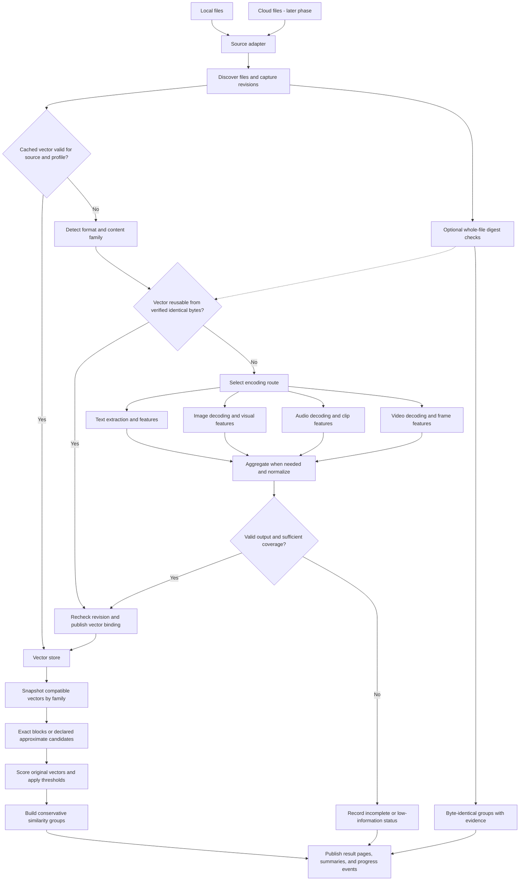
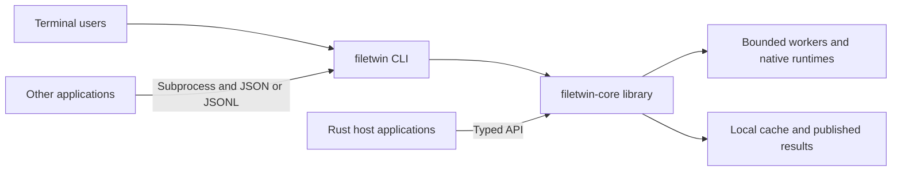

# Content Similarity Architecture

Status: target architecture with implemented text/document, image, audio and video encoders.
Date: 2026-09-09.
Selected implementation language: **Rust** for a reusable library and CLI.
Product interface: **CLI only**, with direct Rust library integration.
Selected release targets: **Apple Silicon macOS and Ubuntu Linux on x86-64/ARM64**.
Revision: all four encoding routes implemented and format coverage expanded; calibration and release qualification remain pending.

The proposed application input/output contract is in
[section 12](#12-application-input-and-output-contract).
The gap review, required operational contracts, and remaining decisions are in
[section 13](#13-architecture-review-and-implementation-readiness).

The [project evaluation](file-similarity-evaluation.md) records the evidence,
reuse decisions, and limitations behind this revision. The source review and
small reasoning probes are complete. All four encoding pipelines now run; media
accuracy benchmarks and the broader release gates remain outstanding.

### Current implementation: 0.1.0-dev

The [implementation plan](implementation-plan.md) separates the executable
preview from the later release milestones. [README.md](README.md) is the usage
reference for the code that exists today; later sections of this architecture
also describe components that are still planned.

Implemented: `filetwin-core`, `filetwin-cli` and an isolated `filetwin-worker`;
typed processing requests/errors; JSON/JSONL and schemas; local discovery;
UTF-8/DOCX/PDF text extraction; SSCD images; recording-level spectral landmarks;
sampled/pooled SSCD video; SHA-256 evidence; SQLite and cache reuse; immutable
snapshots; exhaustive cosine matching and groups partitioned by family/profile;
queries, exports, cancellation and resume. All ten public commands are available.
Native artifacts are provisioned explicitly and verified, with no downloads
during processing. Docker and Python are not production dependencies.

The preview requires explicit profile selection (`--experimental` selects all
four current profiles; `--experimental-text` retains the original UTF-8 profile)
and an explicit threshold for every selected profile. It has no promoted
profile or calibrated default. Immutable manifests are available through
`profiles list`; changed representation semantics require a different profile ID.

Important differences from the target design:

- All four families have working experimental encoders. Implemented formats,
  model pins, extraction policies, runtime paths and tests are documented in
  [native-encoding.md](native-encoding.md) and [format-coverage.md](format-coverage.md).
  Image profile v2 adds SDR HEIC/AVIF primary-item and tile-grid decoding through
  FFmpeg 9; the original image profile remains registered for old snapshots.
  OCR, legacy Office, slides/spreadsheets, SVG rendering, PQ/HLG HDR HEIF/AVIF/video,
  sidecars and remote providers remain unimplemented.
- One native worker is started per file and reuses its model across video
  frames. Reusing workers/models between files remains a throughput improvement.
  Native input uses one full bounded staged copy, so frame/audio sampling saves
  decode/inference work but does not avoid reading the original source bytes.
- The scorer is the bounded reference implementation. BLAS kernels, parallel
  extraction tuning, unchanged pair-score reuse and 10 TB measurements are
  deferred. Section 9's experiments do not measure the new executable.
- `result_bytes` currently limits charged inventory/pair work and group
  reservations, not total database/WAL/publication/export bytes. Memory is bounded
  by implementation buffers and admission checks; Linux workers additionally
  have an address-space limit, while macOS has no hard RSS ceiling.
  Global quotas, maintenance, tombstone reconciliation and retention are pending.
  Newly compared snapshots contain only the current job's observations.
  Native staging has a 300-second worker deadline and process-group cleanup.
  Forced host death can leave staged copies; crash-staging collection is pending.
- Fast local validation uses metadata and before/after no-follow checks; it is
  heuristic. Strict validation reports `strict_consistency_unavailable` for
  eligible files. Source changes produce explicit stale outcomes; automatic
  source retries are deferred. Root-parent aliases are resolved once, while the
  explicit root entry and discovered descendants are opened without following
  symlinks. This allows normal macOS `/var/folders/...` paths.
- The local validation host is macOS 26.6.1 ARM64. CI is configured for the
  selected native macOS/Ubuntu matrix; remote CI, the minimum OS floor, signed
  distribution and other filesystems remain release qualification work.

Database schema version 1 and protocol version 1 are explicit preview formats.
Query/catalog record payloads remain extensible JSON values in the Rust API;
processing requests, events, errors, summaries and query inputs have shared Rust
types. Public API stability is not yet promised.

## 1. Purpose and scope

Find files whose underlying content is substantially similar, including small
text edits, resized images, watermarked or recompressed media, and short additions
to otherwise matching recordings. Present related files as groups.

Build an independent product consisting of the `filetwin-core` Rust library and
the `filetwin` command-line executable. Other applications can launch the CLI and
consume structured output; Rust applications can call the library directly.
FileTwin supplies no desktop GUI. Target folders of **10 TB or more** using
streaming access, bounded workers, persistent caches, and resumable scans.

The initial source is the local filesystem. Later adapters will support Google
Drive, Google Cloud Storage, OneDrive, iCloud Drive, and PikPak. Vector generation
runs on the machine hosting the encoder; the initial design uses the user's
computer. Workers deployed near cloud storage are a later deployment option.
Section 5 selects the operating-system/CPU matrix and native packaging baseline.
A host application owns any graphical interface and maps engine events into its
own presentation. Model/runtime packaging must be validated for each release
target before that target is advertised as supported.

| Example | Intended matching behavior |
| --- | --- |
| `Im human!` and `I'm human!` | Recognize the small text edit. |
| Nearby video frames showing a similar scene, saved as photos | Recognize visual similarity in the image group. |
| An image and a watermarked or recompressed version | Recognize the underlying image where enough content remains visible. |
| A 1080p video and its 480p version | Recognize similar footage. |
| A video and a version with a moving watermark | Recognize the unchanged footage despite the overlay. |
| A recording with a short section appended | Aim to retain a high overall similarity when most content is shared. |
| AVI and MP4 versions of the same footage | Compare them within the video group. |

These are evaluation requirements, not accuracy guarantees. A single compact
vector summarizes content and loses detail. It cannot reliably locate a short
clip inside an unrelated long video or measure the exact percentage of shared
content.

## 2. Design decisions

- Use **Rust for the shared processing engine** and optimized native libraries
  for media decoding, model inference, hashing, and matrix arithmetic. Language
  selection and initial dependency choices are settled in section 5; model
  accuracy, binding compatibility, and hardware parity still require validation.
- Put processing and storage adapters in a reusable Rust library. Keep the CLI
  responsible for arguments, terminal rendering, serialization, and signals.
  Keep platform-specific functionality behind interfaces in the Rust core.
- Support **10 TB+ collections** without loading whole files or the entire
  collection into memory. Budget discovery, transfers, decoding, inference, and
  comparison independently, and preserve progress across restarts.
- Store **one active vector per file**, plus metadata. Intermediate section,
  frame, and audio-clip vectors are temporary.
- Reuse encoding work across verified byte-identical files when the profile is
  the same. A cryptographic content digest is metadata, not another perceptual
  vector. Full-file hashing is optional work governed by the validation policy.
- Use four processing routes: **text/documents, images, audio, and video**.
  Static versus time-based content alone does not determine the encoder.
- Compare only compatible vectors within the same content family. Images never
  compare with videos, even if their pipelines share a visual encoder.
- Treat file extensions as input-format information. AVI, MP4, MOV, and MKV can
  share the video comparison group after decoding through a compatible pipeline.
- Persist vectors and reuse them when source-content validation and the encoding
  profile match. File-attached metadata can carry a portable copy of the cache.
- Start with **batched exact vector comparisons**, followed by conservative
  grouping. Approximate search and dimensionality reduction are later options.
- Separate encoding, candidate retrieval, threshold decisions, and grouping.
  Search settings must not change the encoding profile or silently weaken a
  run's declared completeness.
- Run extraction, inference, comparison, and grouping in bounded engine workers.
  Expose progress and cancellation without taking over a caller's event loop,
  standard streams, process lifetime, or global logging configuration.
- Run CLI jobs in the foreground. An accepted-job event does not detach work;
  the CLI process or embedding host must keep the engine alive.
- Keep model choice, vector dimensions, and thresholds configurable by encoding
  profile. The 512-dimensional vectors used in timing experiments are a capacity
  assumption, not a requirement for every future encoder.

### Lessons adopted from existing projects

| Reference | Adopt or evaluate | Boundary in this application |
| --- | --- | --- |
| Czkawka / Krokiet | Media accuracy baseline; Rust component boundaries; reuse of cached work. | Its temporal signatures are a comparison baseline, not our stored vector format. |
| RustDupe | Document extraction and compact content-overlap features. | Retain meaningful text symbols; benchmark its normalization and SimHash separately. |
| FiftyOne Brain | Independent embeddings, indexes, thresholds, and inspectable related pairs. | Our conservative group invariant and Rust runtime remain authoritative. |
| EmbedAnything | Optional adapter for inference and bounded streaming. | Our code owns whole-file aggregation, timeline coverage, and source validation. |
| Cloud Duplicate Finder | Scope selection and grouped review. | Verify actual access and transfer guarantees for every provider. |

These are selected design references, not selected production dependencies.
Primary sources and component-specific reuse considerations are in the
[evaluation](file-similarity-evaluation.md).

## 3. Data flow



Discovery and encoding can publish progress incrementally. A comparison run uses
a defined snapshot of ready vectors so that concurrent file changes do not alter
the meaning of an in-progress result.

### Exact-copy evidence alongside similarity

Use trusted, scope-compatible whole-file digests that already exist, or compute
them when the chosen scan policy warrants the full read. The SHA-256 digest
remains the default interoperable identity evidence. A supported BLAKE3
implementation may be benchmarked separately; different digest algorithms and
scopes must never be compared as if they were the same key.

Within an exact-copy check, size and small prehashes can avoid unnecessary full
hashing; Czkawka documents this staged pattern in its
[duplicate finder](https://github.com/qarmin/czkawka/blob/master/instructions/Instruction_Core.md).
They cannot prove equality. **Never discard a file from content-similarity
processing because its byte size, extension, or duration differs from another.**
Those would reject the resized, transcoded, and appended examples.

If two current revisions have verified equal bytes and compatible profiles,
encode once and bind both files to the resulting immutable payload. This is valid
only when extraction depends on those bytes and the profile; external resources
or overrides must be included in the input identity. Persist separate file
identities and freshness evidence. Equal bytes do not make an unsupported format
supported, and no vector needs to be fabricated for an empty file.

Full-digest checks must not block every sampled-media job. An absent digest means
the cross-file reuse optimization is unavailable, not that similarity processing
must wait for a full-file read. Record `byte_identical` separately from
`similar_content`, including whether equality rests on a trusted digest or a
byte comparison. Both remain reviewable results.

## 4. File processing routes

| Route | Read and normalize | Produce the stored vector |
| --- | --- | --- |
| Text/documents | Decode text; parse document formats; use OCR when text is scanned. | Compute content-overlap features, or encode sections with a suitable text model, then aggregate. |
| Images | Decode orientation and color consistently; resize to the model's input size. | Run a visual copy-detection encoder. |
| Audio | Decode samples; standardize sample rate and channel policy; select clips. | Encode acoustic content and aggregate clip features. |
| Video | Decode selected frames; standardize image preprocessing. | Encode frames with a visual copy-detection model and aggregate. |

### Text and documents

For the small-edit examples, character or word features are a useful baseline.
They measure content overlap more directly than a model trained only to recognize
topics. Feature hashing supports fixed-size representations and streaming
processing. Small dimensions can introduce collisions, so the text vector size
must be validated independently of the image model's size.
[HashingVectorizer documentation](https://scikit-learn.org/stable/modules/generated/sklearn.feature_extraction.text.HashingVectorizer.html)

Evaluate a deterministic Unicode normalization and case policy with character
three-to-five-grams and word features. Version the feature-hash algorithm, seed,
dimensions, and weighting. Targeted straight/curly apostrophe handling can cover
`Im`/`I'm` without deleting every symbol. Keep decimals and meaningful
punctuation available to the main features. The
[RustDupe source and normalization probes](file-similarity-evaluation.md#rustdupe)
explain this choice. Combining feature families still produces one vector;
freeze their weights before evaluation. Any corpus-fitted weighting belongs in
the profile and cannot silently drift as new files arrive.

Use 4,096 dimensions as the first text evaluation baseline, with NFC content
normalization, preserved case and punctuation, and no corpus-fitted IDF. Compare
character-only and character-plus-word features on the same labeled fixtures
before freezing weights, seed, apostrophe handling, and a production threshold.
This is an experiment configuration, not a registered profile or an accuracy
claim. At float32 it uses 16 KiB per vector; section 9's 512-dimensional kernel
measurements must not be applied to it without rerunning the benchmark.

TXT, Markdown, Word, and text-based PDF can share a text representation after
format-specific extraction. A long static document may still require chunked
processing. Preserve overlap at chunk boundaries when computing character or
word sequences, and use length-aware aggregation where appropriate.

Scanned documents need OCR. A document profile based only on extracted text
does not compare illustrations or layout. Documents where those features matter
need a separately versioned mixed-content profile. Such a profile must explicitly
define how text and visual features are combined; vectors from unrelated encoders
must not simply be averaged together.
[Document extraction documentation](https://docs.unstructured.io/open-source/core-functionality/partitioning)

### Images

Select **SSCD `sscd_disc_mixup`, ResNet50, 512 dimensions** as the first image
evaluation model. It produces descriptors intended for image copy detection;
the larger alternative uses 1,024 dimensions. This selects the experiment, not
a promoted production profile. Preprocessing, converted weights, and accuracy
remain subject to evaluation on this application's files.
[SSCD documentation](https://github.com/facebookresearch/sscd-copy-detection)

Compare SSCD against Czkawka's perceptual image hashes at matched accuracy
requirements. Keep binary fingerprints in the evaluation harness; the initial
production matcher remains normalized float vectors with cosine scoring. The
archived SSCD repository provides a model candidate, not a maintained Rust
runtime. Pin weights and preprocessing, verify any model conversion against the
reference outputs, and record artifact terms before selecting a deployment.

Use a consistent orientation, color conversion, and resize policy. For very large
images, record whether the representation came from the full image, a stored
overview, or selected tiles. Preview-based processing must not silently claim
full-resolution coverage.

### Audio

The baseline objective is recognizing related recordings, including re-encoding
and short appended sections. A model that recognizes the same sound category is
not automatically suitable for recognizing the same recording.

Select an acoustic representation and aggregation method using recording-level
positive and negative examples. Matching the same words spoken in different
recordings is a different objective; a transcript-based profile can support that
later. The experimental implementation now uses 4,096-dimensional pooled spectral
landmarks from mono 16 kHz audio. It covers short recordings completely and
samples up to 32 disjoint eight-second windows centered across longer timelines.
FFT/peak-triplet hashing, signed pooling and normalization are frozen in its profile. This
is an implemented candidate; promotion still requires recording-level evaluation.

Benchmark against Czkawka's acoustic fingerprinting, including recordings of only
a few seconds. A temporal fingerprint can preserve evidence that mean-pooling
loses. This is an accuracy baseline even though it does not satisfy our compact
global-vector design. Audio remains an experimental profile until a fixed-size
descriptor passes the required recording-level cases; a failed evaluation must
not be presented as solved by generic sound-category embeddings.

### Video

Start by evaluating up to **32 frames distributed across the timeline**. Sample
by timestamps rather than encoded frame numbers so that frame-rate changes are
less disruptive. Persist the actual sample positions and the sampling policy.

Use one target near the midpoint of each of N equal-duration intervals, then
record the actual decoded presentation timestamp. Very short videos may have
fewer distinct frames; record the count rather than repeating frames to claim
additional coverage. Seeking starts at a suitable keyframe and decodes forward;
the requested timestamp alone is not evidence of which frame was processed.
Handle rotation, aspect ratio, color conversion, and HDR tone mapping explicitly.

Evaluate N = 16, 32, and 64 across short and long videos. An every-Nth-frame
iterator stopped after a fixed count can cover only an early portion of a long
video. The [EmbedAnything video guide](https://embed-anything.com/guides/video/)
therefore supplies an ingestion reference, while our adapter enforces full
timeline sampling. Any adaptive resampling policy must be deterministic,
bounded, and included in the profile.

Encode the sampled frames and combine their vectors into one descriptor. Using
SSCD frame descriptors with pooling is a proposed baseline; image-model quality
alone does not establish the quality of the resulting whole-video descriptor.

The baseline video profile measures **visual content**. Identical footage with a
different soundtrack may still match. An audio-aware video profile would require
explicit feature fusion, a new profile version, and separate validation.

AVI and MP4 are decoded into comparable visual inputs. A decoder must support the
actual codec inside the container; the extension alone cannot establish that.
FFmpeg is the proposed general audio/video decoder. Platform-native decoding can
be added where useful, with equivalent preprocessing and coverage verified.
[FFmpeg documentation](https://ffmpeg.org/ffmpeg.html)

Sampling keeps processing bounded but can miss short edits or overlaps. Small
insertions may also shift sample positions. More samples or better temporal
aggregation can improve coverage while still producing one final vector.

### Aggregation and normalization

For compatible section vectors `e_i`, a simple candidate aggregation is:

```text
u = sum(weight_i * e_i) / sum(weight_i)
v = u / L2_norm(u)
```

The encoding profile defines the weights and whether section vectors are
normalized before aggregation. Reject non-finite or zero-norm outputs; an empty
file must not become an ordinary searchable zero vector.

Mean pooling loses order. Videos with similar scenes in different orders may
receive similar vectors. Temporal descriptors are an alternative if that causes
unacceptable errors. TMK is one example of a fixed-size descriptor with temporal
features, but its larger signature and scoring procedure are different from the
512-dimensional cosine baseline benchmarked here.
[TMK documentation](https://github.com/facebook/ThreatExchange/tree/main/tmk)

Profiles define minimum usable input and coverage, such as readable text,
decoded frame count, or audio clips containing usable signal. Empty extraction,
failed OCR, repeated failed seeks, and low-information media receive explicit
statuses. They must not appear as confidently unrelated files or a giant group
of zero/default descriptors. Pixel variance or silence tests are diagnostics;
do not claim they establish content uniqueness.

### Encoding profile contract

The application owns an immutable, canonical profile manifest:

```text
family + matching_objective + content_scope
reader/version + decoding/preprocessing policy
model architecture + weights digest, or feature algorithm/seed
sampling + aggregation + input quality/coverage rules
dimensions + dtype + normalization + metric
```

Derive `profile_id` from the canonical manifest, not a mutable model alias.
Record implementation build, execution provider, model artifact source, and
numerical compatibility results as provenance. A changed implementation must
pass parity checks or receive a new profile identity. Different profiles do not
mix just because their vectors have the same dimensions.

Retrieval parameters, decision thresholds, and group rules have separate
identities. A threshold change does not require re-encoding. Changing pooling,
sample coverage rules, model weights, feature weights, or a fitted projection
used to produce the stored vector requires a new representation profile.
Candidate-only projections are versioned separately. Experimental evaluation
can use multiple indexes; a production file still has at most one active vector.

Each release must publish a capability manifest with its supported formats,
promoted profile IDs, and explicit `default_families`. Text and images can ship
before audio/video pass their gates. The default family set is frozen by the
release, not silently narrowed according to which model files happen to exist.
Experimental profiles require explicit profile-ID selection and retain their
experimental status in results. Promotion status and calibration evidence are
registry/policy metadata; changing that evidence alone does not change a vector
representation's profile ID. Section 13 defines the initial format and artifact
requirements that must be resolved before a release advertises support.

## 5. Language selection and standalone components

### Language comparison and decision

**Decision: use Rust for the production core.** The rationale is control over
memory and concurrency, predictable resource cleanup, and memory safety in safe
Rust without a garbage collector. Rust also permits integration with the native
libraries needed for this workload. [Rust overview](https://rust-lang.org/)

The alternatives below remain useful context for the decision. This table is an
engineering assessment, not a measured speed ranking; development effort depends
on the team's experience.

| Language | Pros for this workload | Cons and tradeoffs | Role considered |
| --- | --- | --- | --- |
| **Rust - selected** | High native performance potential, strong memory safety, precise resource control, and concurrent processing. | Ownership has a learning curve; some AI bindings are community maintained; native dependencies still need platform-specific packaging. | Shared production engine and storage adapters. |
| C++ | High native performance potential and direct integration with media, numerical, and GPU libraries. | Complex language and builds; memory safety requires care even with scoped resource management. | Strong alternative for a team experienced with C++ or extensive native runtime customization. |
| Go | Straightforward concurrent workers, good networking, and convenient service development. | Garbage collection has allocation-dependent costs; calling native libraries and distributing their dependencies adds integration work. | Cloud access, scanning, scheduling, and coordinating native processing. |
| Java | Good long-running throughput, mature concurrency, and an official ONNX Runtime inference API. | JVM packaging, heap allocations, and native-memory ownership need attention. | A server deployment or an existing JVM team. |
| C | Precise memory control, low overhead, and direct access to native C APIs. | Manual memory ownership and cleanup; more work to build and maintain the complete application. | Specialized native components. |
| Python | Convenient model development, a broad AI ecosystem, and fast batched operations through native libraries. | CPU-heavy Python loops can be slow; dependency packaging and worker coordination need care. | Model evaluation and benchmarking. |

Go's garbage-collection cost depends on allocation patterns, and its `cgo`
interface provides access to C libraries. Java also provides tunable garbage
collection and native inference bindings. These are practical integration
tradeoffs, not reasons that either language cannot handle a large collection.
[Go GC guide](https://go.dev/doc/gc-guide),
[Go interoperability](https://go.dev/doc/faq),
[Java GC guide](https://docs.oracle.com/en/java/javase/25/gctuning/introduction-garbage-collection-tuning.html)

The surrounding language does not determine the speed of a shared native kernel.
Hashing, decoding, inference, and matrix operations can execute in optimized
libraries from several languages. ONNX Runtime provides C/C++, Java, and Python
APIs and lists Rust bindings as community maintained. Validate the selected Rust
binding or C API integration against each required model and hardware backend.
[ONNX Runtime APIs](https://onnxruntime.ai/docs/api/)

At a sustained read rate of 500 MB/s, any implementation that keeps up with
storage needs about 5.6 hours to read 10 TB. The architecture must reduce repeated
work and unnecessary transfers as well as optimize CPU execution. The Python
harness used in section 9 called native kernels; its measurements do not imply
that a Rust implementation will automatically make those kernels faster.

### Selected release platforms

Use one portable Rust codebase with separate binaries for each OS/CPU target.
macOS is a Unix operating system; Ubuntu is a Linux distribution. Similar command
lines and POSIX APIs help source portability, but do not make their binaries,
native libraries, or filesystem behavior interchangeable.

The following is the selected **first-release qualification matrix**, not a
claim that these builds already exist:

| Platform | CPU and Rust target | Selected baseline and release policy |
| --- | --- | --- |
| macOS | Apple Silicon ARM64; `aarch64-apple-darwin` | Deployment floor macOS 14.0. Test the minimum and every stable major version advertised by the release, including the latest stable version at release time. |
| Ubuntu Linux | Intel/AMD x86-64; `x86_64-unknown-linux-gnu` | Build against Ubuntu 24.04 LTS; qualify on 24.04 and 26.04 LTS. |
| Ubuntu Linux | ARM64; `aarch64-unknown-linux-gnu` | Same Ubuntu baseline; native ARM64 tests are required in addition to cross-compilation. |
| Other 64-bit Linux distributions using glibc | Matching x86-64 or ARM64 target | Compatibility candidates after their native-library requirements are checked. No distribution support claim without a named test environment. |
| Intel macOS, Alpine/musl Linux, FreeBSD/OpenBSD/NetBSD, Solaris/illumos, other CPUs, Windows | Separate future targets | Outside the first release. Add only when there is a concrete user need, maintained native dependencies, and CI coverage. |

Rust lists all three selected target triples as Tier 1 with host tools. ONNX
Runtime 1.28.2 publishes CPU archives for macOS ARM64 and Linux x64/ARM64; its
release asset list contains no Intel macOS archive. These are practical reasons
to start with this matrix, not proof of complete FileTwin compatibility.
[Rust targets](https://doc.rust-lang.org/rustc/platform-support.html),
[ONNX Runtime 1.28.2 artifacts](https://github.com/microsoft/onnxruntime/releases/expanded_assets/v1.28.2)

Choose Ubuntu 24.04 as the build baseline to keep the initial native build simple
and test the newer 26.04 LTS as well. Their standard maintenance periods extend
to May 2029 and May 2031 respectively. Ubuntu 24.04 uses glibc 2.39; initially
advertise **glibc 2.39 or newer as a necessary Linux binary requirement**, together
with the package's recorded C++ runtime and other shared-library requirements.
That condition alone is not sufficient to guarantee another distribution works.
Ubuntu 22.04 and older are outside this binary baseline. A broader, older-glibc
build can be added later without changing the public application protocol.
[Ubuntu release cycle](https://ubuntu.com/about/release-cycle),
[Ubuntu 24.04 libc package](https://packages.ubuntu.com/noble/libc6)

macOS 14.0 is a chosen product deployment floor, not a value inferred from Rust's
minimum OS version. Audit the deployment target and imported symbols of every
bundled native library; rebuild an incompatible dependency for this floor or
explicitly revise the matrix before release. Likewise, reject Linux artifacts
requiring newer glibc/C++ symbols than the baseline. Do not use the build machine's
`target-cpu=native` for general releases: optional CPU instructions need runtime
detection and a tested baseline path, including inside native libraries.

The default inference provider is **CPU on every selected platform**. A GPU is
optional. Core ML on macOS and CUDA on Linux are later, explicit acceleration
options after numerical and accuracy parity tests. Different backends cannot
silently change profile compatibility or threshold decisions.

Keep platform differences behind the local-source and process adapters: raw
filename bytes, file identity, case sensitivity, timestamps, no-follow opens,
locking, signals, process-tree cleanup, and durable rename/flush behavior. Do not
lowercase or Unicode-normalize filesystem locators to make them look portable.
Use POSIX-byte path encoding on both selected OS families. Cross-platform backup
restore preserves historical records but requires source-location rebinding and
freshness validation before reusing current bindings.

Qualify APFS on macOS and ext4 on Linux for the working index first. Keep
`data_dir` on a local filesystem; do not place its live SQLite/WAL files on
NFS/SMB or inside a cloud-synchronized folder. Other mounted filesystems can be
source inputs under the adapter's reported capabilities and freshness limits.
SQLite WAL requires same-host coordination and is unsuitable for a shared
network database. Filesystem support is a separate promise from OS support.
[SQLite WAL constraints](https://sqlite.org/wal.html)

### Selected toolchain and production stack

Use **Rust 2024 edition and Rust 1.98.1** as both the initial pinned toolchain and
minimum supported source-build version. Record them in `rust-toolchain.toml` and
Cargo `rust-version`; both are present in the workspace. Rust 1.98.1 is the September 3,
2026 stable patch release. Commit the CLI/workspace `Cargo.lock`; upgrades use
reviewed lockfile/native-artifact changes and rerun the target matrix. Users of
the distributed CLI do not need Rust or a compiler installed.
[Rust 1.98.1](https://blog.rust-lang.org/2026/09/03/Rust-1.98.1/),
[Rust 2024 edition](https://doc.rust-lang.org/edition-guide/rust-2024/index.html)

The native text/document/image/audio/video stack is built and tested locally.
Native integration, model parity and format smoke tests are implemented. Signed
packaging, accuracy calibration and the complete platform matrix remain pending.

| Component | Selected implementation baseline | Responsibility |
| --- | --- | --- |
| Similarity coordinator | Rust | Own scope, resumable jobs, cancellation, snapshots, resource budgets, and progress events. |
| Source adapters | Rust interfaces with local and provider-specific implementations | List files, track identities and revisions, and provide byte or materialized-file access. |
| Extraction input | Revision-bound seekable reader or bounded local materialization | Give parsers and decoders one content-access contract; record bytes fetched and decoded-input coverage. |
| Format readers | Streaming UTF-8; `image` 0.25.10 with an explicit codec list; PDFium Chromium 8044 / `pdfium-render` 0.9.4; bounded `zip` 8.6.0 / `quick-xml` 0.42.0; FFmpeg 9 | Working experimental routes; each retains independent accuracy and platform release gates. |
| Content hasher | Rust `sha2` SHA-256 behind the content-digest interface | Process bounded buffers and record digest algorithm, scope, and source revision. |
| Encoding workers | Rust text feature hashing; `ort` pinned to `=2.0.0-rc.13` with ONNX Runtime 1.28.2 CPU for neural evaluation | Pin the prerelease binding behind an internal adapter; reuse loaded models and validate conversion/parity before promotion. |
| Vector store | `rusqlite` 0.40.1 with SQLite and binary vector payloads | CLI enables bundled SQLite; core exposes an optional bundling feature so embedding hosts control native linkage. Enforce section 13's durability/version checks in either mode. |
| Batch matcher | Apple Accelerate on macOS; OpenBLAS on Linux; portable reference scorer for correctness | Compute compatible vector blocks with bounded native threads. Qualify threshold decisions against the reference on all targets. |
| Retrieval planner | Rust; exact blocks initially, optional approximate backend later | Estimate pair/output cost and record the chosen completeness policy; score candidates using the original vectors. |
| Group builder | Rust | Enforce the membership rule and retain related-pair evidence. |
| Public library API | `filetwin-core` Rust crate | Expose engine lifecycle, typed requests, job handles, cancellation, status, and bounded result pages. |
| CLI adapter | `filetwin-cli`, executable `filetwin`, using `clap` | Resolve arguments/configuration, run foreground jobs, handle signals, emit human or structured output, and map outcomes to exit codes. |
| Serialized contracts | `serde`/`serde_json`, checked JSON Schema Draft 2020-12 documents, and typed semantic validation | Keep JSON/JSONL and Rust requests aligned; schema validation alone cannot check operation-specific runtime constraints. |

Disable `ort`'s automatic binary/model download features. Load the packaged,
verified native runtime by an explicitly resolved path. The selected `ort`
release targets ONNX Runtime 1.28 but is still a release candidate; pin both
`ort` and `ort-sys` exactly, keep their types out of the public API, and test this
pair on every target. A direct C API adapter is a fallback if the binding fails
qualification, not an additional public API.
[ort release](https://github.com/pykeio/ort/releases/tag/v2.0.0-rc.13),
[ort pinned manifest](https://raw.githubusercontent.com/pykeio/ort/v2.0.0-rc.13/Cargo.toml)

Bundling SQLite in the CLI avoids depending on the user's system SQLite version;
making that feature optional in the library avoids imposing a native linkage
choice on the host. Pin the actual bundled SQLite version/build in release
provenance. Similarly, disable `image` default formats and implicit worker pools
so dependency features do not expand advertised coverage or concurrency.
[rusqlite configuration](https://github.com/rusqlite/rusqlite),
[image feature selection](https://github.com/image-rs/image)

`clap` and Serde stay within their argument/serialization roles. Put schemas in
a versioned `schemas/` directory at implementation time; golden fixtures and the
shared Rust validator must cover additional semantic rules. Pin remaining crate
patch versions and OpenBLAS at the first passing build instead of inventing a
tested lockfile in this design document.
[clap](https://docs.rs/clap/latest/clap/), [Serde](https://serde.rs/),
[JSON Schema 2020-12](https://json-schema.org/draft/2020-12),
[OpenBLAS](https://www.openmathlib.org/OpenBLAS/docs/user_manual/)

For later acceleration, evaluate the provider on its deployment hardware. Model
operator support, fallback behavior, accuracy, and throughput must be checked;
choosing a GPU backend alone is not a performance guarantee.
[Execution providers](https://onnxruntime.ai/docs/execution-providers/),
[Core ML provider](https://onnxruntime.ai/docs/execution-providers/CoreML-ExecutionProvider.html),
[Apple Accelerate](https://developer.apple.com/documentation/accelerate)

Keep scanning, cache policy, matching, and grouping reusable through the Rust
core. Separate asynchronous source access from bounded CPU and inference work.
Coordinate worker counts with native library thread pools to avoid oversubscribing
the machine. Use reusable buffers and bounded queues between stages. A slow
encoder must cause discovery and decoding to slow down instead of accumulating
unbounded pending data.

Python-based extraction examples cited elsewhere describe algorithms or research
tools; Python is not a production runtime dependency. Use PDFium text extraction
in an isolated process for the later PDF route; its Rust wrapper serializes native
calls because PDFium is not inherently thread safe. DOCX starts with explicitly
bounded `zip`/`quick-xml` extraction of document text, with unsupported embedded
content reported. OCR is deferred to a separate reader/profile addition.
Selected readers still need coverage and resource-limit fixtures.
[PDFium Rust integration](https://github.com/ajrcarey/pdfium-render)

An optional EmbedAnything adapter must emit temporary features through the same
encoder contract as direct ONNX inference. It must not own source discovery,
write its own competing active-vector index, or choose a different whole-file
sampling policy. Evaluate Czkawka components in the same way before accepting a
library dependency; benchmark CLI applications separately from the production
engine.

Bound jobs by estimated bytes as well as worker count. Each stage reserves its
share of decode buffers, model memory, temporary files, and output blocks before
starting. Use per-volume I/O limits, per-provider transfer limits, and an
inference concurrency budget that accounts for native thread pools. Put
uninterruptible or crash-prone native parsing/decoding in restartable worker
processes with deadlines; a failed file should not terminate a collection scan.

Expose perceptual results with a distinct `similar_content` match kind. An
embedding score must not imply that two files are byte-identical or that one can
be deleted automatically. Similarity discovery produces reviewable results.

### CLI and library boundaries

Workspace layout; the core and CLI exist, and the native worker is deferred:

```text
Cargo.toml                         # workspace
crates/filetwin-core/src/lib.rs     # engine, adapters, contracts, storage
crates/filetwin-cli/src/main.rs     # binary target named filetwin
crates/filetwin-worker/src/main.rs  # internal native worker, added with native readers/inference
```

Keep request/result types in a public `filetwin_core::api` module. Internal
SQLite rows, decoder objects, inference tensors, and worker implementations are
not public API types. The CLI depends on the core; the core never depends on the
CLI. Cargo supports distinct library and executable targets.
[Cargo package layout](https://doc.rust-lang.org/cargo/guide/project-layout.html)

The internal worker is a companion executable for isolated native processing,
not another user-facing interface. Its private protocol is versioned and tied
to the matching FileTwin release. Native-enabled Rust hosts supply its absolute
path through `EngineConfig.runtime`; the core never invokes the public CLI to
perform library calls. Plain-text processing and catalog queries must work
without native model/decoder workers installed. Keep worker-only native
dependencies out of the minimal core build.



The initial integration paths are the CLI subprocess protocol and a Rust crate
dependency. If a non-Rust host later requires in-process calls, add a separate
C-compatible adapter with opaque handles, explicit allocation/free functions,
error mapping, and callback/thread rules. `cdylib` and `staticlib` are relevant
artifact types; the native Rust ABI offers no stability guarantee. That adapter
needs its own versioned contract and is not implied by publishing a Rust crate.
[Rust linkage](https://doc.rust-lang.org/reference/linkage.html),
[Rust ABI](https://doc.rust-lang.org/reference/items/external-blocks.html#abi)

### Engine lifecycle and host ownership

The following signatures express responsibilities, not a frozen Rust API:

```text
Engine::open(EngineConfig, HostServices) -> Result<Engine, Error>
Engine::submit(JobRequest) -> Result<JobHandle, Error>
Engine::resume(JobId) -> Result<JobHandle, Error>
JobHandle::id() -> JobId
JobHandle::events() -> bounded receiver of typed JobEvent values
JobHandle::cancel() -> cancellation acknowledgement
JobHandle::wait() -> JobSummary
Engine::shutdown() -> Result<(), Error>
Catalog::open_read_only(data_dir) -> Result<Catalog, Error>
Catalog::status(StatusQuery) -> Result<JobStatus, Error>
Catalog::results(ResultsQuery) -> Result<ResultPage, Error>
Catalog::export(ExportRequest) -> Result<ExportManifest, Error>
```

`submit` validates the request, persists acceptance, and returns a handle while
engine workers perform the job. Initially, one engine accepts one active
processing job at a time and reports `engine_busy` for another; it still runs
bounded per-file workers. The current preview runs one isolated native process
per file and reuses the model for that video's frames. A persistent worker pool
that reuses loaded models and buffers across files/jobs remains the target for
throughput tuning. A CLI invocation coordinates the entire scan.
Load models lazily for operations that encode. Comparing cached vectors requires
profile definitions and the scoring backend, but not decoder executables or
original model weights. Queries do not initialize scoring or encoding runtimes.
Resume validates encoding dependencies only when unfinished work requires them.

The host owns the engine lifetime. `wait` is blocking; async hosts must bridge
it through their own scheduling, or consume events without blocking their event
loop. Internal asynchronous source access must not start nested runtimes on the
caller's thread. Runtime details stay behind the API until bindings are chosen.
Cancellation acknowledgement confirms the request, not that workers have stopped;
`wait` supplies the final outcome. `shutdown` requests cancellation, drains owned
workers, commits recoverable progress, and releases the processing lock.
Dropping a handle does not detach
a job from the engine; dropping the engine requests shutdown, but callers must
use explicit shutdown to observe completion or failure. Forced process death
can only preserve work committed before that death.

The library returns typed errors and routes diagnostics through host-supplied
logging hooks. It does not print, call `process::exit`, install global signal
handlers/loggers, change the working directory, or implicitly open a browser.
`HostServices` supplies adapter/credential resolution and diagnostic hooks;
credentials are never serialized into job requests or results. Progress delivery
is bounded and coalescible. Job state, errors, and terminal summaries are durable
so a slow or dropped event receiver cannot lose the authoritative result.

### Headless packaging and configuration

Distribute a relocatable archive per selected target, containing `filetwin`,
the companion worker when needed, required native libraries, a capability/build
manifest, and dependency notices. The first text release needs no model bundle;
neural model bundles are separate explicit installations. Resolve packaged
libraries/helpers relative to the installation, never the current directory.
Sign and notarize the public macOS distribution, including its nested binaries;
publish authenticated release manifests and artifact checksums for all targets.
Package-manager wrappers can follow the verified archives. Containers and
all-in-one cross-Unix binaries are not first-release deliverables.

**Docker policy: optional tooling and later deployment packaging.** Installing,
running, or embedding FileTwin must not require Docker. The CLI uses its packaged
dependencies, and SQLite runs inside the application without a database service.
Linux CI may use a pinned container build environment; local development remains
available with native tooling, and macOS qualification requires native macOS tests.

A future Linux container image can package the same CLI, native dependencies,
and JSON/JSONL protocol for server or cloud workers. Build x86-64 and ARM64 images
when needed. Mount source collections instead of copying them into image layers;
use read-only source mounts by default and keep writable index/checkpoint storage
persistent on a supported local filesystem. Explicit sidecar writes require an
appropriately writable source. Qualify permissions, host/container path mapping,
stable source identity, cancellation, and restart behavior before advertising
container support. Container packaging does not add a daemon or change the API.

On macOS, Docker Desktop runs Linux containers in a Linux VM and shares host
files through mounts. That adds a filesystem/VM boundary to qualify for large
scans; it does not exercise FileTwin's native macOS/Accelerate path. Use the native
CLI as the default Mac deployment. A Linux image also does not establish support
for every Unix host or remove CPU/kernel compatibility requirements.
[Docker host mounts and VM behavior](https://docs.docker.com/engine/storage/bind-mounts/)

Select **FFmpeg/ffprobe 9.0.1** as the later media decoder build baseline, with
the exact source digest, build flags, codec list, and distribution terms recorded
in the artifact manifest. This selects a starting version, not working media
support. Launch the tools directly with argument arrays, bounded pipes, disabled
stdin interaction, and the worker's resource/timeout controls. Permit only the
input protocols/resources authorized by the adapter. A host-supplied FFmpeg build
requires the same version/coverage/parity checks as a packaged one.
[FFmpeg releases](https://ffmpeg.org/download.html)

Release the CLI and library with explicit model/native-runtime requirements for
each supported platform. Model discovery and profile resolution must work
without a graphical session. A scan reports `model_not_installed`,
`decoder_unavailable`, or `authentication_required` when prerequisites are
missing; it must not silently download large models or start an interactive
login. Model installation and cloud connection setup are separate, explicit
operations. Host applications may provision them before opening the engine.

`EngineConfig` supplies absolute data/model/temp paths, resource defaults, and
native-runtime configuration. Library calls do not read CLI flags or implicitly
inherit environment-based settings. The CLI resolves its configuration into that
same type and records non-secret execution provenance. Section 12 specifies the
proposed commands, precedence, fields, and output protocol. A `doctor` command
reports installed capabilities before a caller starts expensive work.

## 6. Persistent data and cache validity

### Storage and portability

Persisting a vector avoids repeating extraction and inference on later scans.
Use an embedded store such as SQLite as the working index so comparisons can load
vectors together without opening every original file. Optionally export/import
the same cache record through file-associated metadata to reuse it after a move
or on another installation with a compatible encoding profile.

| Storage location | Applicable files | Main tradeoff |
| --- | --- | --- |
| SQLite index | Any supported content type | Efficient bulk access; the cache stays with the application unless exported. |
| Filesystem extended attribute (`xattr`) | Any file format on a filesystem that supports the attribute | Attaches binary metadata without inserting it into the file's data bytes; preservation depends on the copy tool, filesystem, and cloud provider. |
| Sidecar such as `movie.mp4.similarity.json` | Any file format | Keeps the original unchanged; both files must be moved or synced together. |
| Embedded container metadata, such as a custom XMP field | Formats with a supported metadata writer | Travels inside the file, but writing it changes file bytes and needs format-specific handling. |

macOS supports textual or binary extended-attribute values; unsupported
filesystems and attribute-size limits require a fallback. See
[Apple's extended-attribute API](https://github.com/apple-oss-distributions/xnu/blob/main/bsd/man/man2/setxattr.2).
Embedded metadata is a format-specific integration; XMP provides an extensible
metadata model, but it is not a universal metadata header for every file format.
See [Adobe's XMP documentation](https://developer.adobe.com/xmp/docs/).

Proposed initial implementation: the SQLite cache, with optional sidecar export
for portability. A macOS extended-attribute adapter can follow. Native embedding
needs a separate adapter for each supported format. Cloud adapters must establish
which metadata survives upload, download, and content replacement before relying
on it. Cache sidecars are implementation files and must be excluded from discovery
as documents to encode.

### Cache records

Store floats in a defined binary format rather than decimal JSON arrays. A JSON
sidecar can carry the same bytes as Base64. One 512-dimensional float32 vector is
2,048 bytes before the record fields; Base64 increases that payload to 2,732
characters. These are alternative copies of the same logical vector, not
additional feature vectors per file. Keeping both the index and an exported
sidecar consumes storage for both copies.

| Record | Main fields |
| --- | --- |
| File | `file_id`, source namespace, locator, source revision, family, MIME type, size, modification time, processing state |
| File location | `location_id`, `file_id`, source membership, lossless locator, enumeration epoch, last observation, availability state |
| Encoding profile | `profile_id`, encoder/weights version, reader and preprocessing versions, sampling and aggregation settings, dimensions, dtype, normalization, content scope |
| Source digest | Source revision, digest algorithm, scope, value, evidence origin, verification time, optional byte-comparison evidence |
| Vector payload | Immutable `vector_id`, `profile_id`, binary vector, coverage/quality metadata, creation time, optional verified content key |
| Active vector binding | Unique `file_id`, source revision, `vector_id`, freshness evidence, last validation time |
| Job | `job_id`, resolved collection request, scope, lifecycle state, current attempt, snapshot/run references |
| Job attempt | Job/attempt identity, processing owner, execution provenance, aggregate progress, start/end, terminal reason |
| File task | Parent job, file/revision/profile, stage, attempt count, lease, checkpoint, resource estimate, error classification |
| Comparison block task | Run ID, immutable block coordinates, scoring-policy ID, lease, atomic completion/edge checkpoint |
| Snapshot | `snapshot_id`, scope/source memberships, immutable file-outcome and vector-ID manifests, profiles, validation times, exact-copy reporting policy |
| Match run | `run_id`, scope, immutable vector-ID manifest, retrieval configuration, score metric, threshold version, grouping-policy version, completeness and block checkpoints |
| Result publication | Run or snapshot ID, `result_revision`, immutable output records, coverage, counts, publication time |
| Match/group | Run identity, published result revision, vector-ID pair, retained score and decision, group membership, group minimum similarity, optional exact-copy class |

Each file has at most one published active vector. A replacement can be built in
temporary staging and atomically published when complete. Old profile vectors
must not be compared with new profile vectors during a migration.

Multiple file bindings may reference one verified reusable payload. This shares
storage without giving a file multiple active vectors. Preserve payloads while
active bindings, retained snapshots, or published result revisions reference
them, then reclaim unreferenced data.
Index source identity/revision, profile/vector identity, pending jobs, verified
content keys, and run/pair identities; avoid loading every record to find work.

Keep the working SQLite database on a local application-data volume. Use a
serialized writer queue, bounded transactions, and a tested WAL/checkpoint
configuration. WAL has one writer at a time and requires same-host access;
cloud synchronization of the live database is not the portability mechanism.
Use exported records or a consistent backup.
[SQLite WAL documentation](https://sqlite.org/wal.html)

The configured `data_dir` owns `index.sqlite3`, job checkpoints, and a processing
owner lock. Initially allow one engine/process to mutate a given index at a
time, including migrations and checkpoint recovery. Acquire an OS-backed lock
before opening the engine for work; a second owner receives `cache_busy`. A PID
stored in a file is not sufficient ownership evidence. Within the owner, retain
the serialized writer queue and per-job leases from this design.

Read-only `status`, `results`, and `export` access can coexist with the owner
through the catalog API. They do not migrate the database or steal a job lease.
`export` writes only its designated report destination. On opening after an
owner disappears, recover committed work and identify interrupted attempts
before accepting a resume. A live owner's job cannot be resumed elsewhere.
Host applications use these APIs rather than depending on internal SQL tables.

Publish result revisions atomically. Cursors identify an immutable published
revision within a run or index snapshot, so resumed processing cannot change an
already paginated view. Retain payloads and evidence referenced by snapshots or
published result revisions; garbage collection must respect these references. Status
counters may update while a job runs, but result pages expose only published
revisions. Section 12 defines their visibility and pagination semantics.

Build each run's immutable vector-ID manifest in a short consistent database
operation, then process its payloads in bounded reads. This avoids holding a
database read transaction open throughout a long scan. Checkpoint score blocks
and their retained edges transactionally so retrying a block is idempotent.

The cache key includes:

```text
source namespace + stable file identity + source revision + encoding profile
```

An exported record also carries a schema version, encoding-profile definition or
resolvable identifier, dimensions, dtype/byte order, normalization, sampling
coverage, creation time, and source size/revision hints. When available, include
`digest_algorithm = sha256`, `digest_scope = file-data-bytes-v1`, and the digest.
This scope means all bytes returned by reading the original file, excluding
filesystem attributes and separate sidecars. A missing digest must remain
explicit; metadata hints are not a substitute for a computed digest.

Freshness evidence is explicit, for example `local_stat_hint`,
`provider_content_revision`, or `whole_file_digest`, together with the
validation time and the bound revision. These labels describe different
guarantees and are not interchangeable confidence levels. Cache freshness,
embedding quality, and match confidence are separate properties.

Validate imported records against the expected profile and vector shape, reject
non-finite or invalid vectors, and validate the source before publishing the
imported vector to the index. A stored content hash does not authenticate who
produced the vector; reuse assumes a trusted cache producer.

### Per-file storage estimate

The raw vector size is fixed by its dimensions and numeric representation:

```text
raw vector bytes = dimensions × bytes per component
float32 uses 4 bytes per component
```

| Dimensions | Raw float32 vector |
| ---: | ---: |
| 256 | 1,024 bytes / 1 KiB |
| 512 | 2,048 bytes / 2 KiB |
| 1,024 | 4,096 bytes / 4 KiB |
| 2,048 | 8,192 bytes / 8 KiB |

These are sizing examples, not a requirement that every content family use the
same dimensions. The selected encoding profile determines its dimensions. A
5 MB, 100 MB, 5 GB, or 100 GB file has the same raw vector size when encoded with
the same fixed-dimensional profile. The final video vector does not grow with
duration; sampling diagnostics remain bounded by the profile's sampling budget.

For a 512-dimensional float32 vector, allow approximately **4–8 KiB per portable
JSON cache record** for planning. This includes Base64 vector data, a SHA-256
digest, source hints, profile identity, timestamps, and modest coverage metadata.
SHA-256 contributes 32 bytes in binary or 64 ASCII bytes as hexadecimal; the
vector contributes 2,732 ASCII bytes when Base64 encoded. A serialized draft
record was about 3.3 KiB with image coverage metadata and 3.6 KiB with 32 video
sample timestamps. Those are illustrative record sizes, not measurements of an
implemented FileTwin cache.

The estimate assumes a resolvable profile ID referencing a shared profile
manifest. Repeating the complete manifest, long locators, extra diagnostics,
format wrappers, or different vector dimensions can exceed this allowance.
Model weights belong in shared application storage, not in each file's record.

| Storage method | Increase to the original file's data bytes | Separate storage used |
| --- | --- | --- |
| SQLite working index | 0 bytes | Binary vector and database records, indexes, and database overhead |
| JSON sidecar | 0 bytes | Approximately 4–8 KiB per record under the assumptions above |
| Extended attribute | 0 bytes | Record plus filesystem metadata allocation; binary serialization can avoid Base64 |
| Native embedded metadata | Format-dependent; generally the serialized record plus its container wrapper | Rewriting, padding, and allocation rules can change the actual growth |

For one copy of a record budgeted at 4–8 KiB:

| Number of files | Estimated record data |
| ---: | ---: |
| 8,000 | 31.25–62.5 MiB |
| 32,000, such as 8,000 in each of four families | 125–250 MiB |
| 1,000,000 | 3.81–7.63 GiB |

These totals exclude filesystem allocation overhead, shared model files,
database indexes and journals, retained results, and temporary or historical
records. Keeping sidecars alongside the database adds their storage to the
database total. Verified identical files can share a payload in the working
index, reducing vector storage there. Folder capacity alone, such as 10 TB,
cannot determine the cache size: file count, profiles, and retained records do.
Here, 1 KiB = 1,024 bytes, 1 MiB = 1,024 KiB, and 1 GiB = 1,024 MiB.

### Validation and the embedded-hash problem

For local files, use a stable file identity where available, size, and
high-resolution modification information as change indicators. These are not a
proof of byte identity. A fast mode can reuse an established local cache when
these indicators match. Strict verification computes the current whole-file
SHA-256 and compares it with the stored digest. The stored digest alone cannot
prove that the current file is unchanged.

A rename should update the locator without necessarily recomputing the vector.
If revision hints changed but a verified digest and encoding profile still match,
reuse the vector and refresh its source binding. Cloud sources should use a
documented content revision or content identifier. A signed URL is not a revision,
and an ETag must not be assumed to be a whole-file cryptographic hash.

Do not place a whole-file hash inside the bytes covered by that same hash:

```text
hash original file -> write vector and hash into file -> file bytes change
```

Rewriting the stored hash repeats the problem. SQLite, a sidecar, or a custom
extended attribute avoids it because the cache record is outside the hashed file
data. Native embedding needs a versioned, format-aware hashing scheme that
excludes the cache region and hashes the final serialized file layout elsewhere.
Keep metadata that affects feature extraction, such as image orientation, within
the validated scope. C2PA's
[data and container hash specifications](https://spec.c2pa.org/specifications/specifications/2.4/specs/C2PA_Specification.html)
illustrate explicit exclusions for embedded records; this architecture does not
require implementing C2PA.

### Reuse flow and verification cost

```text
discover file and capture revision
look up local cache; if absent, inspect a supported attached/sidecar cache
if cache exists and its profile is compatible:
    validate source using the selected fast or strict policy
    if validation succeeds:
        recheck revision; restart if the source changed
        publish/import the cached vector and return it
generate vector from a stable source revision
compute a source digest if required by the selected policy
recheck revision and atomically publish the cache record
```

Before encoding, a verified content-key lookup may reuse a compatible payload
from another file. Without verified identity, continue normal extraction.
Publish the payload, active binding, and completed-job state in one transaction,
conditional on the expected file generation, requested profile, and job lease
still being current. A late worker must not overwrite a newer revision or
profile's result. A filesystem/provider consistency guarantee is still needed
for strict reads; a database transaction alone cannot freeze the source file.

Fast validation of a new imported cache needs a trusted revision binding; matching
only a copied size and modification time is insufficient. Without such a binding,
verify its digest or recompute. A model, preprocessing, or sampling-profile change
requires re-encoding even when the file hash is unchanged. Conversely, a byte
change invalidates a whole-file digest even if the visible content still looks
similar; regenerate the vector before evaluating that similarity.

Whole-file hashing reads every byte. A 100 GB file requires a 100 GB read on a
strict validation scan unless a trusted source can already attest to the same
content digest or revision. Approximate hashing time is file size divided by
effective read-and-hash throughput. On cloud storage, obtaining the bytes can
dominate this cost. Hashing may take longer than generating a video vector from
32 sampled frames, and its full-read cost must be added to the sampled-generation
estimates in section 9 when a digest is required. Computing a digest during an
existing full download can avoid a second read.

Read the revision before extraction and recheck it before publication. If the
source changed, discard the staged result and reschedule it. Hashing and encoding
must refer to the same stable content revision; use a snapshot or equivalent
source guarantee when strict consistency is required. Deleted or content-changed
files invalidate their current bindings and current-result eligibility. Retained
snapshots and published results remain historical evidence; they are not rewritten
or deleted by a reconciliation scan. Changing only a similarity threshold
requires comparison/grouping again, not file re-encoding.

Suggested per-file processing states are `discovered`, `queued`, `encoding`, `ready`, `stale`,
`insufficient_content`, `unsupported`, `failed`, and `cancelled`.
Track partial extraction as coverage, not a successful full-content result.
Preserve completed work when a scan is cancelled. Report partial scans explicitly
and never treat an unreadable file as an unrelated file with a valid vector.
These states belong to file tasks/outcomes, not the collection job lifecycle in
section 12. A completed file task cannot complete its parent collection job.

## 7. Batched comparison

Partition ready vectors by:

```text
comparison family + compatible encoding profile + selected scan scope
```

For normalized vectors, cosine similarity is a dot product:

```text
similarity(a, b) = dot(a, b)
block_scores = vectors_block_A * transpose(vectors_block_B)
```

Process only the upper triangle of each group's matrix, excluding self-matches.
Use bounded blocks, initially around 1,024 rows, and apply the group's threshold
to each block before reusing its working memory.

```text
for each compatible comparison group:
    open the immutable manifest of compatible normalized vectors
    for each upper-triangle pair of row blocks:
        load or reuse the two required vector blocks
        compute dot products with native matrix operations
        retain qualifying non-self pairs
    build groups from retained evidence
```

Keep all vectors resident only when they fit the configured memory budget.
Otherwise page payloads into reusable row buffers; a manifest does not require
loading every vector. Within a run, freeze numerical scoring and threshold
boundary rules. Validate scores near the cutoff with a reproducible reference
calculation so backend rounding does not silently change group membership.

This remains exhaustive comparison within the selected group. Batching improves
execution efficiency; it does not change the quadratic number of file pairs:

```text
pairs_in_group = N * (N - 1) / 2
total_pairs = sum(pairs_in_group for each compatible group)
```

For incremental scans, unchanged-to-unchanged scores can be reused when the
profile, scope, and threshold policy allow it. Compare changed or new vectors
with compatible cached vectors, then rebuild affected groups. Retaining only
above-threshold scores means lowering the threshold requires calculating missing
pairs again.

If K of the N vectors in the new snapshot are new or changed, and all remaining
pair evidence is reusable, the new score count is:

```text
K * (N - K) + K * (K - 1) / 2
```

With N = 8,000 and K = 100, this is 794,950 pairs instead of 31,996,000.
This is arithmetic, not a measured incremental latency. Exclude edges for
superseded/deleted vector bindings from the new run and compare the changed set with all eligible
unchanged vectors plus itself. A scope expansion must also compute newly
eligible old-to-old pairs. An incomplete prior run cannot supply complete
unchanged-pair evidence.

Group partitions depend on the current graph and deterministic ordering:
recompute affected candidate components, or the whole partition when cheaper.
Do not merely append a new member to a cached group. Score caches key immutable
vector identities and metric versions, while run manifests define which file
bindings and pair ranges those scores cover.

A cosine score is not a percentage of identical content or a calibrated
probability. Thresholds must be learned from representative positive and negative
pairs separately for each profile.

### Retrieval modes and completeness

| Mode | Candidate generation | Guarantee and status |
| --- | --- | --- |
| Exact, initial default | Every compatible pair in bounded blocks. | Exhaustive for ready vectors in the declared snapshot when every block finishes. |
| Incremental exact | Changed/new pairs plus complete reusable old evidence. | Same result scope as a fresh exact run under the same policies. |
| Approximate, later option | A measured nearest-neighbor/range index. | Some qualifying pairs may be missed; record settings, evaluated recall, and approximate status. |

For the 8,000-per-type scenario, exact mode remains the starting point. Decide
future cutovers from measured pair count, dimension, memory, and latency budgets,
not folder terabytes alone. Faiss is an evaluation candidate for this later
index; native packaging and Rust integration are not yet selected.
[Faiss documentation](https://faiss.ai/)

Always compute candidate decisions from the original compatible vectors.
Approximate retrieval followed by exact rescoring cannot recover a pair the
retriever never returned. Fixed top-k can also miss members of a large duplicate
group; a cap must be visible in completeness metadata. Similar duration,
resolution, file size, and cheap perceptual hashes may prioritize work, but
cannot reject pairs in an exhaustive cosine run without a valid score bound.

PCA used only for candidate retrieval belongs to the retrieval configuration;
2D/3D projections used for browsing belong to visualization metadata. Neither
defines final group membership. A transform that changes the stored
representation creates a new encoding profile.

Track two kinds of incompleteness independently: source coverage (unsupported,
unreadable, or unsampled content) and comparison coverage (unfinished blocks,
approximate retrieval, or result limits). An exhaustive vector run is still
based on sampled media when that is the encoding profile.

## 8. Grouping similar files

Similarity is not transitive. If `A` matches `B` and `B` matches `C`, it does not
follow that `A` matches `C`.

For the initial design, use a conservative membership rule: **every pair in a
displayed group must meet that profile's similarity threshold**.
Complete-linkage clustering cut at the corresponding distance threshold is one
way to implement this rule, but need not be the initial large-component
implementation.
[Clustering documentation](https://scikit-learn.org/stable/modules/clustering.html)

Start with a deterministic greedy partition within each candidate component:
visit files in stable identity order; add a file to the first stable-ordered
group where its pair with every member is eligible under the requested pair
scope and passes the threshold; otherwise create a new group. Display singleton
files separately. Missing evidence for an eligible pair in approximate mode
must be scored before admitting a member. This guarantees group consistency but
does not maximize group size or matching pairs kept within groups.

Retain qualifying pair relationships even when they cross final group boundaries.
For example, a strict partition may put `A` and `B` together and leave `C`
standalone, while still showing the valid `B`-to-`C` relationship. A disjoint
partition cannot always satisfy both all-pairs consistency and putting every
matching pair in the same group.

DBSCAN or connected components can find candidate families, but they can join
files through chains of intermediate matches. K-means assigns files to a chosen
number of groups, including files without a close copy. Neither behavior is the
default final-group rule for this feature.

Dense candidate components can make grouping and result storage expensive even
when matrix arithmetic is fast. Bound working memory, persist or recompute
evidence in blocks, and report any result limit as partial processing. Silently
keeping only a small top-k list would change the exhaustive-match guarantee.

Verified byte-identical classes can be represented as member lists sharing one
vector and identity proof; there is no need to materialize every internal pair.
Apply the requested pair scope to exact-copy groups too. Sharing a payload does
not make a cross-scope pair eligible. In `within_each_source` mode, overlapping
source memberships can still require partitioning an identical-content class.
Expand aliases when displaying/exporting files. For other dense matches, retain
bounded edge blocks on disk and paginate results. At 50,000 files, all qualifying
pairs would need about 30 GB even at an illustrative 24 bytes per edge, before
database indexes, while the 512-dimensional vectors use only 102.4 MB. Stop or
checkpoint at the configured output budget and explicitly mark the run partial.

## 9. Performance baseline and planning estimates

The measurements below describe the reference Mac used during the discussion.
They are not hardware requirements or performance promises for the independent
application. Storage and transfer estimates use decimal MB, GB, and TB unless
explicitly marked MiB or GiB.

### Measured comparison arithmetic

Benchmarks were run during the architecture discussion on an **Apple M5 Pro,
18 logical CPUs, 64 GiB RAM**, using Apple Accelerate through a Python `ctypes`
harness. Inputs were normalized synthetic float32 vectors with 512 dimensions.
The synthetic fixture reused generated rows; it was not an accuracy dataset.

Vectors were already resident in memory. The matcher calculated upper-triangle
blocks, including diagonal calculations, and discarded score blocks. Timings
exclude file discovery, decoding, inference, normalization, database access,
threshold filtering, result materialization, and grouping.

| Files in one group | Unique non-self pairs | Median score computation | Raw vector storage |
| ---: | ---: | ---: | ---: |
| 1,000 | 499,500 | 0.36 ms | 2.048 MB |
| 5,000 | 12,497,500 | 8.7 ms | 10.24 MB |
| 10,000 | 49,995,000 | 35 ms | 20.48 MB |
| 50,000 | 1,249,975,000 | 0.85 s | 102.4 MB |

The specific **8,000 files per type** experiment processed four groups
sequentially:

| Scope | Files | Unique non-self pairs | Median score computation |
| --- | ---: | ---: | ---: |
| Each of four synthetic type groups | 8,000 | 31,996,000 | Approximately 22 ms |
| All four groups combined | 32,000 | 127,984,000 | 89.5 ms |

The combined median came from five warmed runs, with observed totals from 89.1
to 90.2 ms. Type labels do not affect the arithmetic; equal vector dimensions and
counts explain the similar per-group times.

At 512 float32 values, one vector uses **2,048 bytes (2 KiB)**. The 32,000 vectors
use **65.536 MB**, excluding metadata. A 1,024-by-1,024 score block uses about
4.2 MB. Blocking avoids retaining an entire 50,000-by-50,000 float32 score matrix,
which would occupy 10 GB. Result edges and grouping state need separate budgets.

The measured 89.5 ms is a matrix-computation baseline, not a complete application
latency target. Earlier discussion budgets of seconds for an application scan
were unmeasured allowances and must be replaced with end-to-end measurements.

### Vector creation estimates

These are illustrative local-disk planning estimates, not measured throughput
for an implemented encoder. Models are assumed to be loaded already.

| Content and assumed method | 5 MB | 100 MB | 5 GB | 100 GB |
| --- | ---: | ---: | ---: | ---: |
| Plain text, all content, streaming features at an assumed 5-50 MB/s | 0.1-1 s | 2-20 s | 2-17 min | 35 min-6 h |
| Scanned documents under the OCR scenario below | 5-30 s | 2-10 min | 1.4-8.3 h | 1.2-7 days |
| Image, decode/resize/embed | 0.1-2 s | 1-15 s | Dimensions/format needed | Dimensions/format needed |
| Audio, up to 32 short clips with efficient seeking | 5-60 s | 5-60 s | 5-60 s | 5-60 s |
| Video, up to 32 frames with efficient seeking | 5-30 s | 5-30 s | 5-30 s | 5-30 s |

The OCR scenario assumes **0.5 MB per page** and **0.5-3 seconds per page**.
Actual page count must replace the size-derived assumption. Text-based PDF and
Word files can skip OCR and instead pay extraction plus text-feature cost.
Neural text embeddings require their own throughput measurement.

The audio/video estimates are sampling budgets. They are not full-file scan
times and assume a decoder can seek efficiently. A large media file with poor
indexing can take substantially longer. Giant images may have usable stored
overviews or may require a specialized decoder; compressed size alone cannot
predict the work.

Processing 32 frames and keeping their vectors costs approximately the same
encoding work as processing those 32 frames and averaging them. The single-vector
decision mainly reduces persistent storage and later matching work. Increasing
the sample count increases encoding work without changing the final vector size.

### Content-hash cost

A SHA-256 microbenchmark on the reference Mac processed a repeated **4 MiB memory
buffer**, feeding **512 MiB per run** into the hash in each of five runs. Median
throughput was **3.204 GB/s**, with observed rates of 3.185-3.228 GB/s. This measured
the hashing implementation on data already in memory, not disk or cloud access.
It was a small kernel benchmark, not an end-to-end Rust scanner benchmark.

For illustration, assume an effective read-and-hash rate of **0.5-2 GB/s**:

| File or collection size | Estimated full-content hashing time |
| --- | ---: |
| 5 MB | 2.5-10 ms |
| 100 MB | 0.05-0.2 s |
| 5 GB | 2.5-10 s |
| 100 GB | 50-200 s |
| 10 TB | 1.4-5.6 h |

These values are size divided by assumed throughput. They are not disk
measurements; opening files, contention, and per-file overhead add time. A scan
of 8,000 files averaging 100 MB reads 800 GB, taking about 7-27 minutes at those
assumed rates before additional processing costs.

Hashing ordinary file bytes does not decode text, images, audio, or video, so byte
count and read/hash throughput drive its cost. A faster hash implementation does
not eliminate the full-read requirement. Follow section 6's fast or strict
validation policy; a stored hash cannot verify current bytes without reading
them again or relying on a trusted source revision. When a full download is
already needed, hash its bytes in file order to avoid a second full read.

### Scaling beyond 10 TB

Total byte size controls transfer and full-hash work. File count, content type,
duration, page count, sampling policy, and vector dimensions control other parts
of the pipeline. These example collections each total 10 TB:

| Files | Average file size | Raw 512-dimensional float32 vectors | Unique all-pairs comparisons within one compatible family |
| ---: | ---: | ---: | ---: |
| 100 | 100 GB | 0.2048 MB | 4,950 |
| 10,000 | 1 GB | 20.48 MB | 49,995,000 |
| 1,000,000 | 10 MB | 2.048 GB | 499,999,500,000 |

The comparison column deliberately assumes a single compatible family. Real
collections are partitioned by family and profile before counting pairs. Raw
vector sizes exclude file records, indexes, model memory, match evidence, and
grouping state. Do not extrapolate the small warmed benchmark to millions of
files without measuring the complete pipeline.

For large collections:

- Persist discovery pages and job checkpoints as work proceeds; avoid collecting
  every path or pending task in memory before starting processing.
- Use bounded read buffers, decoded-frame buffers, inference batches, and queues.
  Account for native model allocations and temporary disk usage as well as the
  Rust heap.
- Limit readers according to storage behavior. Additional parallel reads can
  reduce throughput, particularly on seek-sensitive storage.
- Cache unchanged files and resume interrupted work. Separate discovery,
  transfer, hashing, decoding, inference, matching, and grouping measurements.
- Keep comparison blocks bounded. Blocking reduces working memory, but does not
  reduce exhaustive pair count. Evaluate an approximate index when measured file
  counts and latency budgets justify it, using the recall checks in section 11.
- Put explicit budgets on dense match output and grouping. Report partial
  results whenever a limit prevents completing the requested work.

## 10. Local and cloud source adapters

### Shared source contract

Keep source access behind an interface with these conceptual operations:

```text
list_page(scope, cursor) -> entries, next_cursor
stat(file_identity) -> revision, size, metadata, access capabilities
changes(scope, cursor) -> changed/deleted entries, next_cursor   # optional
read_range(file_identity, expected_revision, offset, length) -> bytes, revision evidence
materialize(file_identity, expected_revision) -> local file handle
```

The local adapter supplies filesystem access. Separate Rust adapters handle
Google Drive, Google Cloud Storage, OneDrive, iCloud Drive, and PikPak. The core
owns transfer retries, revision checks, and checkpoints. A CLI connection store
or host-supplied credential resolver supplies account authorization and token
refresh through the same adapter contract. Processing never requires a GUI login
or browser launch. Provider, account, and
drive/bucket identity belong in the source namespace; paths and download URLs
alone are insufficient cache identities.

An adapter reports its actual capabilities: content revision, available checksum
algorithms and scopes, byte-range access, change tracking, download status, and
metadata-write support. Optional features require a fallback. Keep the source
contract independent of any one provider's fields or SDK.

Give the decoder a revision-bound seekable input with a bounded range cache, or
a materialized local file when seeking is unavailable. Source adapters own
conditional requests, retries, and URL refresh. A decoder's hidden network
requests must not bypass those revision and transfer controls. Record access
capabilities as verified, unavailable, or unknown for the deployed account/API.
An unknown revision guarantee cannot be promoted to a trusted cache hit.

### Local versus cloud scanning

This comparison assumes that the encoder runs on the user's computer. Listing
cloud metadata does not produce an embedding. A new vector requires the content
selected by that encoding profile to reach the encoder. Once compatible vectors
are in the working index, the same matching engine can compare files across
storage providers within the selected family and scan scope.

| Operation | Fully downloaded local files | Cloud files accessed through an API |
| --- | --- | --- |
| Discover files | Read directories and filesystem metadata. | Read paginated listings, respecting authorization and API limits. |
| Generate vectors | Read content from disk. | Transfer required content; partial reads can reduce bytes for some profiles and formats. |
| Validate cached vectors | Use identity, size, and modification time as hints; hash when stronger verification is required. | Use documented content revisions or appropriate checksums where available, potentially avoiding another download. |
| Detect changes | Combine filesystem notifications with reconciliation scans. | Use provider change feeds or delta queries where available; otherwise poll and reconcile. |
| Recover interrupted work | Resume extraction and comparison from checkpoints. | Also handle expired URLs, authorization refresh, interrupted transfers, and throttling. |
| Compare cached vectors | Run against a consistent vector snapshot. | The same operation; source content need not be fetched again until invalidation. |
| Budget resources | Disk I/O, memory, CPU/GPU, and temporary storage. | Also budget request latency, bandwidth, provider quotas, and any applicable request, retrieval, or transfer charges. |

A synced folder behaves as local storage for content access only when the needed
bytes are resident. A visible placeholder can still require a download. Respect
download status and bounded staging space rather than materializing a 10 TB
collection at once. iCloud Drive explicitly supports cloud-only and downloaded
items. [Apple's download-status documentation](https://support.apple.com/en-gb/guide/mac-help/mchl1a02d711/mac)

### Provider differences

Google Drive and Google Cloud Storage are distinct services with separate
adapters. The following documented behavior was checked during this design
discussion; validate account capabilities and deployed API behavior when building
each adapter.

| Provider | Adapter and cache/change tracking | Content access and integration considerations |
| --- | --- | --- |
| Google Drive | Drive API for file IDs, paginated listings, and changes. Use documented revisions and available checksums. | Stored binary files can expose MD5 and, when available, SHA-256. Docs Editors and shortcuts do not expose those SHA-256 values. Workspace documents need an export profile. [Metadata](https://developers.google.com/workspace/drive/api/reference/rest/v3/files), [changes](https://developers.google.com/workspace/drive/api/guides/manage-changes), [downloads/exports](https://developers.google.com/workspace/drive/api/guides/manage-downloads) |
| Google Cloud Storage | Object API; bind cache records to bucket, object name, and content `generation`. | `metageneration` tracks metadata changes separately. CRC32C and eligible MD5 checksums have different availability and purposes. A worker near the bucket can avoid routing content through a home connection. [Metadata](https://docs.cloud.google.com/storage/docs/metadata), [deployment guidance](https://docs.cloud.google.com/storage/docs/best-practices) |
| OneDrive | Microsoft Graph; use drive/item identity, content tags where available, and delta queries. | A file's `cTag` tracks content, while `eTag` also covers metadata. The documented `sha256Hash` field is unsupported; never require it as a universal cache key. Respect Graph throttling and refresh transient download URLs. [Item metadata](https://learn.microsoft.com/en-us/graph/api/resources/driveitem?view=graph-rest-1.0), [hashes](https://learn.microsoft.com/en-us/graph/api/resources/hashes?view=graph-rest-1.0), [delta](https://learn.microsoft.com/en-us/graph/api/driveitem-delta?view=graph-rest-1.0), [throttling](https://learn.microsoft.com/en-us/graph/throttling) |
| iCloud Drive | Begin with an OS-synced-folder adapter that understands download status and user-granted access. | Cloud-only files require content download before encoding. Start with this documented access path; a general provider REST interface for the user's entire drive is not assumed. [Apple documentation](https://support.apple.com/en-gb/guide/mac-help/mchl1a02d711/mac) |
| PikPak | Dedicated adapter using supported Connected Apps access, such as WebDAV or CLI integration. | Connected Apps transfer quotas can constrain a large scan. Verify listing, content access, ranges, and revision/hash semantics for the chosen integration; do not assume a provider content identifier is SHA-256. [Official FAQ](https://mypikpak.com/en-US/faq), [Connected Apps quota](https://mypikpak.com/en-US/connect-apps-faq) |

Keep provider revisions, cryptographic digests, and corruption-detection checksums
as different metadata types with explicit semantics. An opaque ETag, CRC32C, or
QuickXorHash is not interchangeable with a whole-file SHA-256 digest. Use trusted
content revisions for cache freshness where supported; apply the strict
verification policy when those guarantees are insufficient.

Use SQLite as the working vector index for all providers. Optional sidecars or
attached records provide portability, but custom metadata fields, payload limits,
and preservation across sync tools must be checked per adapter. Store the same
logical vector in these records; provider-specific storage does not create a new
comparison space. Importing or writing cache metadata must not cause an endless
content-invalidation loop.

### Partial reads and transfer planning

Cloud sampling requires verified range or seek support, not just a URL. Readers
may need container headers, an index near the end, and data surrounding selected
frames. Sampling 32 frames does not guarantee a tiny transfer.

Google Drive supports byte-range downloads for binary content, but not while
exporting Workspace documents. OneDrive requires range requests to target the
actual download URL; a server can return a full response if it cannot generate
the range. Check the response status and returned range before accepting it as
partial data. [Drive partial downloads](https://developers.google.com/workspace/drive/api/guides/manage-downloads#partial_download),
[OneDrive partial downloads](https://learn.microsoft.com/en-us/graph/api/driveitem-get-content?view=graph-rest-1.0#partial-range-downloads)

Validate revision consistency across requests. If reliable random access is
unavailable, materialize the file through the bounded transfer layer and expose
that transfer as part of scan progress. Signed URLs are transient access details,
not persistent identities or values to place in diagnostic logs. Cloud retries
must respect provider backoff instructions and preserve completed work.

Approximate transfer time is:

```text
transfer_seconds = bytes_fetched * 8 / effective_bits_per_second
```

| Bytes fetched | Sustained network rate | Ideal transfer time |
| --- | ---: | ---: |
| 100 GB | 100 Mbps | 2.2 h |
| 10 TB | 100 Mbps | 9.3 days |
| 10 TB | 1 Gbps | 22.2 h |

These are transfer-only lower bounds at the stated rates, excluding request
latency, throttling, retries, and processing. Processing can overlap with
transfers. Partial reads may reduce bytes fetched but add request latency. Track
actual bytes transferred separately from sample count and inference progress.

For a future Google Cloud Storage deployment, workers can run near the bucket
and return vectors and metadata to the index. Other providers may also be read
by an independently hosted worker through their supported interfaces; storing
files with a provider does not itself provision an encoder there. Remote worker
costs, model/backend compatibility, and source access require their own deployment
validation. Native and remote workers must produce vectors compatible with the
same encoding profile before sharing a comparison group.

## 11. Validation and implementation sequence

### Evidence status and delivery order

The [existing-project review](file-similarity-evaluation.md) is complete.
The following steps are planned implementation and runtime evaluation work.
Public feature lists and the matrix-kernel timings in section 9 do not satisfy
these gates.

1. **Build the labeled corpus and baseline harness.** Specify the fixture matrix
   below, record original/variant relationships, and separate calibration from
   held-out evaluation. Wrap the selected baseline applications in a development
   harness with per-file outcomes and original similarity scores.
2. **Establish the Rust library and CLI.** Define source, reader, encoder, cache,
   matcher, grouping, and public request/result interfaces. Build a thin CLI over
   the library, with the same processing behavior for direct and subprocess
   callers. Validate native-library packaging on selected release targets.
3. **Select and freeze encoding profiles.** Evaluate text, image, audio, and video
   candidates against representative examples. Record dimensions, preprocessing,
   aggregation, coverage, and thresholds. Validate the deployed model runtime,
   not just a research implementation. Text and images can graduate independently;
   keep audio/video experimental if their fixed-size profiles fail.
4. **Implement local extraction and caching.** Add bounded background jobs,
   revision checks, verified content reuse, atomic publication, cancellation,
   leases, restart recovery, and sidecar import/export.
5. **Implement comparison and grouping.** Use native matrix blocks, profile
   thresholds, deterministic conservative groups, and incremental invalidation.
   Establish exact results as the reference before adding approximate retrieval.
6. **Stabilize CLI and library integration.** Implement human output, versioned
   JSON/JSONL, paginated queries, export, error/exit mappings, and cancellation.
   Exercise a direct Rust host and a subprocess caller against the same fixtures.
7. **Validate 10 TB+ operation.** Measure representative file counts and byte
   volumes, bounded memory and staging space, restart recovery, incremental
   scans, and dense comparison output. Replace planning estimates with observed
   end-to-end throughput.
8. **Add cloud adapters.** Implement Google Drive, Google Cloud Storage, OneDrive,
   iCloud Drive, and PikPak through the shared contract. Verify authorization,
   listing pagination, change tracking, range reads, quotas, and revision handling,
   with a bounded complete-download path where necessary.

### Accuracy corpus and comparison protocol

Start with at least 200 independent originals per family and multiple variants
per original. This is a pilot corpus, not evidence for every possible format or
collection. Split by original source or recording session, keeping all of its
variants in the same partition, so related content cannot leak between
calibration and held-out sets. Add hard negatives and a larger
background collection; pair accuracy on a balanced toy set does not predict
precision when scanning millions of mostly unrelated pairs.

| Family | Required positives | Hard negatives and diagnostic cases | Baseline comparison |
| --- | --- | --- | --- |
| Text/documents | Straight/curly apostrophes, whitespace, small edits, TXT/PDF/DOCX equivalents, scanned text where supported. | Same template with substantially different body; decimal/symbol edits; boilerplate; failed or empty OCR. | RustDupe extraction/SimHash versus our streaming feature vector. |
| Images | Similar-scene nearby frames saved as images, resized copies, stationary watermarks, repeated JPEG compression. | Unrelated images of the same category, low-information images, orientation/HDR cases. | Czkawka perceptual hashes versus the chosen copy encoder. |
| Audio | Same recording re-encoded/resampled, gain changes, short appended content; include clips only a few seconds long. | Different speakers saying the same words, similar sound categories, silence, unrelated recordings with a common intro. | Czkawka acoustic fingerprints versus fixed-size candidates. |
| Video | AVI/MP4 versions, 1080p to 480p, static/moving watermarks, changed frame rates, short appended footage. | Unrelated content with the same intro; very long/short videos; bad seeking; reordered scenes as an order-sensitivity diagnostic. | Czkawka temporal windows, optional TMK, and pooled 16/32/64-frame variants. |

Define watermark area/opacity and appended duration explicitly. For example,
include additions of 1%, 5%, and 10% of original duration, plus 25% as a stress
case. Reordering is a diagnostic for the visual-content objective; do not label
it a mandatory negative without changing that objective. Same words in different
voices belong to a separate transcript objective.

Tune each baseline and our profile on the calibration split, then freeze both.
Compare recall at the same precision target and report each tool's own metric.
Do not use equal numerical thresholds across Hamming distance, cosine, and
temporal scores. Record baseline preprocessing, minimum supported duration,
sampling settings, and unsupported files rather than silently dropping failures.

Measure pair precision/recall and group consistency, including two-file groups
and the `A-B-C` chaining case. Test source edits during extraction, cache reuse,
profile changes, cancellation, and partial failures. Measure end-to-end creation
and comparison separately, including cold startup, peak memory, decoding,
thresholding, dense match output, progress delivery, and cancellation latency.

### Proposed acceptance gates

These are initial engineering targets, not achieved measurements:

| Gate | Evidence required before promotion |
| --- | --- |
| Content matching | At least 99% pair precision and 95% recall on supported, held-out required transformations, reported per family and transformation with counts and uncertainty. Expand the corpus before generalizing. |
| Coverage | Report both conditional accuracy on successfully encoded files and end-to-end recall with unsupported/failed positives counted as misses. No unreported drops. |
| Group consistency | Every pair in every displayed group passes the original-space threshold; chaining and incremental-update fixtures obey the invariant. |
| Cache correctness | Zero stale publications in revision-race fixtures; unchanged fast-mode files cause zero encoder calls; strict-mode reads are measured separately. |
| Exact-copy reuse | Verified identical bytes with the same profile reuse one payload; changed revisions and different profiles cannot borrow an incompatible vector. |
| Incremental matching | A resumed/incremental run produces the same pairs and deterministic groups as a fresh exact run on the same final snapshot and policies. |
| Approximate retrieval, if enabled | At least 99% qualifying-pair retrieval recall against exact results on the evaluation corpus, including dense duplicate groups; final end-to-end accuracy also passes. Still label the mode approximate. |
| Resource limits | Resident/native memory, staging bytes, result storage, and queues stay within declared budgets; cancellation/restart preserves committed work. |
| CLI/library parity | Equivalent resolved requests produce the same pairs, groups, coverage, and error meanings through both entry points. |
| Process and output contract | JSON/JSONL stays parseable with noisy native dependencies; large, slow, or closed pipes remain bounded and cancellable; a missing terminal response is not accepted as success. |
| Host lifecycle and cache ownership | The library does not alter global process settings; shutdown releases workers/locks; concurrent processing owners fail clearly while read-only queries remain usable. |
| Discovery reconciliation | Offline roots, denied directories, narrowed filters, and interrupted listings never create false deletion records; hard links retain all observed locations. |
| Artifact and storage lifecycle | Model/profile fixtures round-trip reproducibly; backup/restore, interrupted migration, retention, low disk, and cursor expiration obey section 13. |

If no single-vector candidate meets the relevant gate, revise its encoder or
aggregation within the storage policy and keep that profile experimental.
A profile that reaches the recall target by accepting unrelated same-category
files fails the precision gate. Temporal fingerprints remain evaluation
baselines; production must preserve the one-active-vector policy.

### Performance and reproducibility

Benchmark 1,000, 5,000, 8,000, 10,000, and 50,000 files per family. Add a
million-vector synthetic test for matching/index capacity, clearly separate from
real-file extraction and 10 TB I/O. Use real readable data for the 10 TB claim;
sparse files, logical cloud sizes, and repeated cached data are not full-read
throughput evidence.

Record cold start/model loading, first scan, unchanged rescan, 1% changes, 10%
changes, rename-only, threshold-only, and interrupted/resumed runs. Report
median and p95 file latency, total elapsed time, peak memory/staging/output,
files skipped/failed, full bytes read, decoded frames/pages, cache reuse, and
time spent in discovery, transfer, hashing, decode, inference, scoring, and groups.
Do not present the 89.5 ms warmed score-kernel measurement as scan latency.

Each result needs a corpus manifest, source/variant labels, app/library
release or commit, model digest, profile and threshold IDs, retrieval settings,
hardware/OS, native backend/thread counts, storage/network conditions, and raw
measurements. Compare cold and warm baseline runs separately. A faster outcome
with lower coverage or different matching semantics is not an equivalent win.

For cloud adapters, test interrupted pagination, expired change cursors, deletes
and renames, transient download URLs, throttling, ignored range requests, and
content replacement during a multi-request read. Verify that a cloud placeholder
does not count as encoded content and that an unchanged cloud revision reuses
the existing vector without downloading its original file again.

Use fake adapters for deterministic failure injection and separate live-provider
contract checks for real behavior. Track listing requests, range/full-read
responses, transferred bytes, and retries. Provider names in a dependency's
README do not replace these checks.

For CLI/library delivery, validate schema-version rejection, unknown fields,
empty/no-match results, per-file failures, exit codes, explicit paths, missing
models/credentials, read-only queries, and incompatible database versions.
Test interrupt/resume, owner death, repeated engine calls, and cursors spanning
a newer published result revision. Exercise subprocess stdout and stderr
concurrently with slow readers and early pipe closure. Run integration fixtures
with no terminal or graphical session and confirm that no prompt blocks them.

Dimensionality reduction such as PCA and approximate nearest-neighbor indexes
remain optional optimizations. Neither removes the initial file-processing cost.
PCA can change relevant distances; fit and version it per compatible profile and
validate retained matches. Approximate search can miss neighbors and must be
evaluated for recall before replacing exhaustive matching.
[PCA documentation](https://scikit-learn.org/stable/modules/decomposition.html#pca),
[Faiss documentation](https://faiss.ai/)

## 12. Application input and output contract

Status: proposed interface; names and defaults below are design decisions, not
implemented commands, released library signatures, or an existing network API.
The CLI and library share processing request/result types. Users normally supply
only source files or folders. Profiles and application settings supply the
remaining defaults, and every accepted job records its fully resolved settings.

Keep four contracts separate: `EngineConfig` for the embedding environment,
`JobRequest` for processing, query/export requests for retained results, and CLI
output options for presentation. Selecting JSONL instead of human text must not
change encoding, matching, or cache identities.

### Entry points and command surface

| Proposed CLI command | Library input/operation | Output and lifetime |
| --- | --- | --- |
| `filetwin scan PATH...` | `submit(JobRequest { operation: scan, ... })` | Discover, index, compare, and group. Foreground until the attempt ends; return IDs, coverage, and summary. |
| `filetwin index PATH...` | `submit(JobRequest { operation: index, ... })` | Populate the cache and publish a vector snapshot; no similarity run. |
| `filetwin compare --snapshot ID` | `submit(JobRequest { operation: compare, ... })` | Compare an existing snapshot; no original-file reads, hashes, or encoder calls. |
| `filetwin run --request FILE` | Deserialize one `JobRequest`, then submit it. | Same job behavior as the corresponding command; `--request -` reads one JSON object from stdin through EOF. |
| `filetwin resume --job ID` | Resume the stored job after acquiring processing ownership. | Continue eligible unfinished work in the foreground; emit a new attempt ID. |
| `filetwin status --job ID` | `Catalog::status(StatusQuery)` | One current job-status response, including coverage, owner state, and resumability. |
| `filetwin results --run ID --kind KIND` | `Catalog::results(ResultsQuery)` | One bounded page from a published result revision. |
| `filetwin export --run ID --report-format FORMAT --report-dir DIR` | `Catalog::export(ExportRequest)` | Stream a published revision into report files; return an export manifest. |
| `filetwin profiles list` | List installed profile manifests and policies. | Profile IDs, families, dimensions, model availability, calibration status, and defaults. |
| `filetwin doctor` | Inspect runtime and installed capabilities. | App/schema versions, providers, decoders/backends, model availability, and path/dependency diagnostics. |

Use an explicit command; bare `filetwin` prints help. `scan` remains the default
`operation` inside a processing request. The `run` command accepts only
`scan`, `index`, or `compare` requests; queries and resume use their own typed
inputs and commands. A host should launch the executable with an argument array,
send JSON directly when needed, and retain its process handle for cancellation.
It should not construct shell command strings from source paths.

### Operations and lifecycle

The CLI acquires the processing lock, validates prerequisites, and persists job
acceptance before emitting `accepted`. It then keeps running. An accepted event
is acknowledgement, not completion or detachment. The Rust `submit` call returns
a live handle while the embedding host keeps the engine alive. An `index` job
has no comparison run until a later `compare` request creates one.

There is no implicit daemon or background queue. Separate invocations of
`status` and `results` query saved state through the read-only catalog; they do
not keep an abandoned job running. `results` requires a published result revision
and returns `results_not_ready` before one exists. An index-only job exposes its
file outcomes through a snapshot query as specified below.

On an orderly halt during discovery/encoding, publish a partial snapshot and
file/error outcomes when the store is usable, even if there are no ready
vectors. This permits inspection after cancellation. It does not freeze future
discovery on resume; a later snapshot gets its own identity. Comparison runs
retain the frozen vector manifest they were created with. If a storage failure
prevents publication, the summary reports null result IDs instead of promising
a queryable page.

For cancellation, terminal users send an interrupt; a subprocess caller signals
the child using the supported platform mechanism; a Rust caller invokes
`JobHandle::cancel`. The CLI translates its supported interrupt/termination
signals into engine cancellation and waits for checkpoint/shutdown. A second
interrupt may force termination and lose uncommitted work. A standalone
`cancel --job ID` command would require a defined control channel and is deferred.
Signal handlers belong only to the CLI, never to the library.

Resuming revalidates unfinished source work and resumes a frozen comparison
snapshot where one already exists. Changed filters, profiles, thresholds, or
scope require a new job/run that may reuse existing work. A `compare` operation
reports the snapshot's original validation time and freshness evidence; it
cannot claim that the source files are still current without another scan.

Cancelled, checkpointed, or interrupted jobs can resume when their status
reports `resumable: true`. `resume` retains the same resolved processing request,
increments `attempt_id`, and requires the original data directory and profile
definitions, plus model artifacts where encoding remains unfinished. It rejects
a live owner, changed processing flags, or incompatible stored state. Total
download/work allowances do not reset on each attempt.

If resource budgets or processing settings must change, submit a new job with
new resolved settings; compatible committed vectors and score evidence may be
reused. A job stopped by an exhausted cumulative budget needs a new job with a
sufficient allowance. Completed jobs with per-file failures are retried through
a new scan. Earlier published result revisions remain immutable.

| Job status | Meaning | Resume behavior |
| --- | --- | --- |
| `queued` | Accepted by the live engine, before processing starts. | Owned by that engine. |
| `running` | The current owner is processing the attempt. | Cannot be resumed by another owner. |
| `checkpointed` | Work stopped at a recorded resource/time limit. | Subject to remaining allowance and compatible prerequisites. |
| `interrupted` | The processing owner disappeared before an orderly terminal update. | Recover committed work, then revalidate unfinished work. |
| `cancelled` | Cooperative cancellation finished. | May resume committed progress. |
| `completed` | The requested pipeline finished, possibly with per-file failures. | Start a new scan to retry those files. |
| `failed` | A fatal job-level error prevented completion. | Submit a new request after correcting the error; retain committed evidence. |

Status is separate from completeness. A `completed` job with unsupported or
failed eligible inputs has partial source coverage. An `interrupted` status is
derived only after ownership is known to be absent; an old heartbeat alone must
not allow stealing a live owner's job.

### Configuration and CLI parameters

Processing commands run non-interactively. Missing parameters, models, or cloud
authorization produce errors. `--non-interactive` makes this requirement explicit
for callers; it is already the default for these commands. Connection setup and
model installation are separate operations whose detailed interfaces are later
work. `doctor` and `profiles list` let callers inspect prerequisites first.

| CLI parameter | Proposed default | Purpose |
| --- | --- | --- |
| `--config FILE` | Explicit `FILETWIN_CONFIG`, otherwise no config file. | Optional TOML configuration, with `[engine]` and `[defaults]` sections. |
| `--data-dir DIR` | `FILETWIN_DATA_DIR`, config, or platform application-data directory. | Own the SQLite index, locks, and checkpoints. |
| `--model-dir DIR` | `FILETWIN_MODEL_DIR`, config, or `data_dir/models`. | Locate installed, verified model artifacts. |
| `--temp-dir DIR` | `FILETWIN_TEMP_DIR`, config, or `data_dir/tmp`. | Bound staging and temporary media in this location. |
| `--format FORMAT` | `human` when stdout is a terminal; `jsonl` otherwise. | Choose `human`, `json`, or `jsonl` for console transport only; automated callers should specify it. |
| `--non-interactive` | Enabled for processing/query commands. | Require execution without prompts, browser launches, or terminal input. |
| `--log-level LEVEL` | `warn`. | Choose `error`, `warn`, `info`, or `debug` for stderr diagnostics; never change result semantics. |
| `--progress-interval-ms N` | `1000`, positive integer. | Throttle progress events/terminal updates; acceptance and terminal events are immediate. |
| `--request-id TEXT` | Generated correlation ID if omitted. | Correlate a flag-based invocation with its responses. In `run`, use the request's field. |
| `--help` / `--version` | None. | Describe syntax or release version; `doctor --format json` exposes machine-readable capabilities. |

Configuration precedence is explicit flags, documented environment variables,
explicit config, then built-in defaults. Only the four `FILETWIN_*` variables
listed above are initially supported. `[engine]` contains data/model/temp paths
and native-runtime configuration. `[defaults]` supplies family/profile, matching,
cache, and resource defaults for new jobs. Secret values do not belong in saved
requests, resolved-request events, or diagnostics.

The selected default `data_dir` is `~/Library/Application Support/FileTwin` on
macOS and `$XDG_DATA_HOME/filetwin` on Linux, falling back to
`~/.local/share/filetwin` when XDG_DATA_HOME is unset or empty. Ignore a relative
XDG_DATA_HOME as invalid under the XDG specification. These standard home/XDG
values are used only by CLI platform-path resolution; they do not add implicit
configuration discovery or environment access to the library. Explicit paths
remain available for embedding hosts and servers.
[XDG base directories](https://specifications.freedesktop.org/basedir/latest/)

For `run --request`, the JSON object supplies processing fields over configured
defaults. Reject additional processing flags, positional sources, or a duplicate
CLI request ID; global path/output options remain valid. Read at most 8 MiB for
one serialized request and reject an oversized input before creating a job.
A flag-based command uses the same validator after constructing its request.
Duplicate scalar flags,
duplicate JSON keys, unknown fields, and incompatible operation fields are
errors rather than silently ignored input.

CLI relative paths resolve once against its invocation directory and are saved
as absolute paths. Paths inside a config file resolve against that config's
directory. Serialized source roots and explicit library paths must be absolute.
The embedding host supplies `EngineConfig` and any defaults explicitly; the
library does not read these environment variables or search for config files.

| Proposed library configuration field | Contract |
| --- | --- |
| `EngineConfig.data_dir` | Required absolute directory for the processing owner and catalog. |
| `EngineConfig.model_dir` / `temp_dir` | Required absolute artifact/staging directories, chosen by the host. |
| `EngineConfig.defaults` | Optional typed profile, matching, cache, and resource defaults; resolve them only for applicable operations. |
| `EngineConfig.runtime` | Absolute worker/decoder/runtime locations, CPU inference by default, and native thread counts; record the actual validated backend and counts. The CLI resolves executable discovery before constructing this configuration. |
| `HostServices.credentials` | Credential resolver/refresh implementation for configured connections; not serializable job data. |
| `HostServices.diagnostics` | Caller-owned diagnostic callback/sink; independent of the job event receiver. |

Concrete runtime-binding fields must implement section 5's selected native stack.
Changing a backend requires the profile parity checks from section 4; selecting
a provider must not silently change numerical compatibility. A library consumer
can reuse one configured engine for repeated calls and query the catalog through
typed requests without a terminal, stdout parser, or CLI configuration file.

### Main processing request parameters

Defaults describe the intended released application. Currently no production
profiles or calibrated default thresholds have been selected.

| Parameter | Required? | Proposed default | Meaning |
| --- | --- | --- | --- |
| `schema_version` | Required in serialized requests. | `1` supplied by the CLI adapter. | Version the public request/result contract. |
| `request_id` | No. | Generate an opaque correlation ID. | Echo in output. This is not an idempotency key; job IDs identify accepted work. |
| `operation` | No. | `scan` | Select the operation above. |
| `sources` | For `scan` / `index`. | None. | Files, directories, or configured cloud roots to inspect. |
| `snapshot_id` | For `compare`. | None. | Exact cached-vector snapshot to compare. |
| `recursive` | No. | `true` | Descend into selected directories. |
| `families` | No. | The release manifest's promoted `default_families`. | Select from `text`, `image`, `audio`, `video`; documents use text. Record defaults and exclusions explicitly. |
| `filters` | No. | No caller-specified restrictions. | Include/exclude paths or extensions, hidden files, and optional byte-size limits. |
| `pair_scope` | No. | `all_selected` | Compare eligible files across all selected sources; `within_each_source` restricts pairs to a common selected source. |
| `matching` | No. | Exact retrieval, profile-specific thresholds, conservative groups. | Similarity criteria and optional threshold overrides. |
| `cache` | No. | Reuse/update the local index with fast validation. | Cache freshness, regeneration, and optional portable metadata. |
| `exact_duplicates` | No. | `reuse_known` | Reuse valid existing whole-file digest evidence; `compute` also runs staged exact-copy checks; `off` omits exact-copy grouping. |
| `limits` | No. | Resolve from application resource settings. | Worker, memory, staging, transfer, and result-storage budgets. |

Console/report settings are not `JobRequest` fields. Persist results locally
and return IDs/summaries; select console presentation through `--format` and
report files through a separate `ExportRequest`.

`sources` is omitted from `compare`; the snapshot already defines its files
and source memberships. In that operation, profiles, filters, families, cache
generation settings, and exact-copy computation cannot be changed. Matching
thresholds, retrieval settings, pair scope, and execution limits may change.
Disallow incompatible fields instead of silently ignoring them.

An `index` request omits `matching` and `pair_scope`; it does not produce
similarity groups. It may calculate/store digest evidence, but exact-copy group
reporting belongs to a scan/comparison result. A `compare` result may reuse
byte-identity evidence already bound to its snapshot; it never calculates a new
source digest.

Operation validation applies before defaults are filled: scan/index-only fields
do not leak from configuration into `compare`, and matching defaults do not
become fields of `index`. Resume loads its stored request instead of resolving
new processing defaults.

| CLI processing option | Request mapping | Applicability |
| --- | --- | --- |
| Positional `PATH...` | `sources[] = { provider: local, root: absolute_path }` | `scan`, `index`; use JSON for structured cloud source specifications. |
| `--recursive` / `--no-recursive` | `recursive` | `scan`, `index`; default true. |
| `--families text,image,audio,video` | `families[]` | `scan`, `index`; an empty list is invalid. |
| `--profile FAMILY=PROFILE_ID` | `profiles[FAMILY]` | Repeat for different selected families in `scan`, `index`. |
| `--pair-scope SCOPE` | `pair_scope` | `all_selected` or `within_each_source`; `scan`, `compare`. |
| `--retrieval exact` | `matching.retrieval` | `scan`, `compare`; reject approximate mode until implemented. |
| `--threshold PROFILE_ID=SCORE` | `matching.threshold_overrides[PROFILE_ID]` | Repeat for distinct compatible profiles in `scan`, `compare`. |
| `--cache-mode MODE` | `cache.mode` | `reuse` or `refresh`; `scan`, `index`. |
| `--validation POLICY` | `cache.validation` | `fast` or `strict`; `scan`, `index`. |
| `--exact-duplicates MODE` | `exact_duplicates` | `reuse_known`, `compute`, or `off`; `scan`, `index`. Index stores evidence without grouping. |
| `--import-sidecars` / `--no-import-sidecars` | `cache.import_sidecars` | `scan`, `index`; default false. |
| `--export-sidecars` / `--no-export-sidecars` | `cache.export_sidecars` | `scan`, `index`; default false. |

The first version fixes `matching.grouping` to `all_pairs`; unknown group rules
are rejected. Repeated map options must use distinct keys. `compare` reuses only
the byte-identity evidence already bound to its snapshot. Its `exact_duplicates`
field is omitted, so it cannot trigger a new hash or change discovery settings.
It inherits the snapshot's exact-copy reporting policy: `off` stays off; the
other policies permit grouping only evidence already available in the snapshot.

Conflicting positive/negative boolean flags are invalid. Explicit profile or
threshold mappings must refer to selected compatible families/profiles;
configured defaults for unselected families are not copied into the request.

The default scan includes hidden entries inside selected roots and follows no
file or directory symlinks. Process regular files; report exclusions for sockets,
FIFOs, devices, symlinks, and other unsupported entry types. Explicit source
roots of those types fail validation. Alias/hardlink identities and overlapping
roots are deduplicated for processing, with every location and source membership
retained under section 13's discovery rules. Automatically
exclude FileTwin's own working index, models, staging files, reports, and cache
sidecars; report these exclusions. Any later symlink-following option needs cycle
detection and explicit scope semantics.

Filters select the requested input set, not matching candidates: choosing only
MP4 files intentionally excludes AVI inputs, whereas selecting the video family
allows supported AVI/MP4 comparisons. `within_each_source` can change the valid
pair set even when two source roots overlap; deduplicate emitted pairs by stable
file identities.

### Source specification

| Field | Meaning |
| --- | --- |
| `source_id` | Optional caller label; generate a stable request-local label if omitted. Used in results and source membership. |
| `provider` | `local` initially; later `google_drive`, `gcs`, `onedrive`, `icloud_drive`, and `pikpak`. |
| `root` | Absolute file/directory path for local sources; adapter-defined stable folder/object identity for cloud sources. |
| `local_path` | Optional lossless local-path object instead of `root`, with the encoding and Base64 fields described below. |
| `connection_id` | Reference to an already configured cloud connection when required. Credentials and transient download URLs are not request identities or report fields. |

A source label is not a file identity. The engine creates stable file IDs using
the source namespace and provider/filesystem identity from section 10. Cloud
roots are validated by their adapter, including account, drive/bucket, and
folder/object identity. A provider that is not implemented returns
`unsupported_provider`; it cannot silently behave as a local path.

File locators are descriptive output, never substitutes for `file_id`. JSON
strings escape path newlines and control characters. For a non-Unicode local
path, retain a display locator plus a lossless `local_path` value containing
`encoding` (`posix_bytes` or `windows_utf16le`) and `base64`. Serialized local
sources may supply that value instead of `root`; require exactly one and reject
an encoding incompatible with the running platform. Unicode paths use `root`
normally. Round-trip tests must cover both forms without lossy replacement.

### Matching, profiles, and cache parameters

| Parameter | Proposed default | Contract |
| --- | --- | --- |
| `matching.retrieval` | `exact` | `approximate` is a later explicit mode; it always carries comparison-recall limitations. |
| `matching.threshold_overrides` | None. | Map a resolved profile ID to a finite minimum cosine score in [-1, 1]. Overrides change decision policy, not vectors. |
| `matching.grouping` | `all_pairs` | Use the deterministic conservative partition from section 8. A candidate component is not automatically a displayed group. |
| `profiles` | Installed default profile for each selected family. | Optional family-to-profile-ID selection for `scan` / `index`; resolve and freeze IDs at acceptance. |
| `cache.mode` | `reuse` | `refresh` explicitly regenerates selected representations instead of taking a cached-vector shortcut. |
| `cache.validation` | `fast` | `strict` verifies whole-file digests or equivalent trusted evidence under section 6; may require reading every byte. |
| `cache.import_sidecars` | `false` | If enabled, accept only a configured trusted producer and validate source/profile bindings as in section 6. |
| `cache.export_sidecars` | `false` | If enabled, export the same vector record after publication where the source adapter can write it. |

There is no universal default such as "90% similar." Each resolved encoding
profile needs a calibrated decision policy. An explicit threshold can be used
for evaluation, but it must be marked as an override with its calibration status.
Unknown profiles, incompatible dimensions/metrics, or a missing default policy
fail validation before expensive processing. An `index` job needs no matching
threshold because it does not compare files.

Encoder name, vector dimension, video frame count, audio clip policy, OCR policy,
and aggregation weights belong in the immutable profile rather than independent
per-file settings. Selecting a different sampling policy creates a different
profile. Callers select complete profiles; routine CLI invocations do not need
to assemble model parameters. `profiles list` reports the resolved profile
metadata and whether its dependencies and decision policy are available.

`cache.mode = refresh` takes precedence over file-cache, sidecar, and verified
content-payload shortcuts. `exact_duplicates = off` controls exact-copy results;
it does not disable a digest required for strict cache validation. Conversely,
`exact_duplicates = compute` does not imply that unique-size files receive a
full hash when staged exact-copy checking can exclude them. Report actual hash
coverage independently.

### Filters and resource parameters

Filters define the requested source set and are valid only for `scan` and
`index`. Exclusions win over inclusions. Include/exclude globs apply to paths
relative to each root, with `/` as the matching separator; cloud adapters expose
the same relative namespace. The initial glob dialect supports `*` within a
component, `?` for one character, and `**` across components, with case-sensitive
matching. Extension filters are case-insensitive and omit the leading dot.
Traversal must still visit directories that could contain included descendants.

| Request field | CLI option | Default and meaning |
| --- | --- | --- |
| `filters.include_globs` | Repeat `--include GLOB` | Empty means all paths; otherwise match any include. |
| `filters.exclude_globs` | Repeat `--exclude GLOB` | Empty; always apply FileTwin's own artifact exclusions too. |
| `filters.extensions` | `--extensions jpg,png,webp` | Empty means no extension restriction. |
| `filters.include_hidden` | `--include-hidden` / `--exclude-hidden` | `true`; hidden means dot-prefixed components or an adapter's explicit hidden attribute. |
| `filters.min_bytes` / `filters.max_bytes` | `--min-bytes N` / `--max-bytes N` | Absent means no bound; inclusive, nonnegative integer bytes with minimum no greater than maximum. |

Byte-size filtering is a caller-selected scope restriction. It must never be
introduced automatically as a similarity candidate filter. If a size or other
required filter attribute is unknown, report that input as unresolved/partial
instead of silently treating it as a match or a non-match for the filter.
The first glob/extension implementation operates on Unicode paths. If an
explicit name filter cannot evaluate a non-Unicode path losslessly, record an
unresolved filter outcome; unrestricted scans can still process that path.

Use integer bytes for byte budgets, seconds for durations, and explicit rates
such as bytes/second for bandwidth. "Automatic" settings resolve to concrete
values before work starts; zero must not ambiguously mean unlimited.

The following are proposed conservative CLI defaults, not measured capacity
guarantees. A library host can supply different defaults in `EngineConfig`.
Resolve and persist exact values for every job before accepting it.

| Request field | CLI option | Proposed default and purpose |
| --- | --- | --- |
| `limits.memory_bytes` | `--memory-bytes N` | `2147483648` (2 GiB); buffers, native model memory, and coordinator state. |
| `limits.staging_bytes` | `--staging-bytes N` | `10737418240` (10 GiB); materialized originals and temporary media. |
| `limits.result_bytes` | `--result-bytes N` | `1073741824` (1 GiB); job pair evidence, groups, and result publications. |
| `limits.io_workers` | `--io-workers N` | `2`; bound file/source concurrency. |
| `limits.inference_workers` | `--inference-workers N` | `1`; account for each model's native thread pools separately. |
| `limits.download_bytes` | `--download-bytes N` | `null`, no caller-imposed total transfer cap; `0` explicitly forbids content transfer. |
| `limits.download_bytes_per_second` | `--bandwidth-bytes-per-second N` | `null`, no caller-imposed bandwidth cap; otherwise positive. |
| `limits.wall_time_seconds` | `--max-runtime-seconds N` | `null`, no job deadline; otherwise positive accumulated running time across attempts, excluding pauses between them. |

Memory, staging, and result budgets and worker counts must be positive integers.
The download allowance is nonnegative; other optional limits are null or
positive. Null transfer/time caps do not disable bounded queues, provider quotas,
profile-specific worker deadlines, or cancellation. `compare` accepts only
memory, result, and wall-time limits; decoding/transfer worker limits do not
apply. Indexing has no pair/group result allocation, but its file outcomes and
snapshot metadata still count toward the result budget.

For nullable limits, a CLI value of `none` explicitly clears a configured cap;
the serialized representation is null. Other numeric options require integers.

Check that the requested profile can fit the resource budget. Report
`resource_budget_too_small` rather than exceeding the limit. If a running job
reaches a transfer or output budget, checkpoint and report the reason and partial
coverage. A paginated result is not partial computation: additional pages remain
retrievable. A computation stopped by a budget is partial even if its first page
looks complete. Cumulative transfer and elapsed-work counters survive resume.
Memory/staging budgets are simultaneous-use bounds. The result budget covers
this job's evidence/publications, not an unlimited lifetime quota for the entire
index; retained cache data and free disk space need separate accounting.

### Query and export parameters

These are separate typed requests, not extra fields of `JobRequest`. Serialized
forms carry `schema_version` and optional `request_id` like processing requests.

| Input | CLI mapping | Contract |
| --- | --- | --- |
| `StatusQuery.job_id` | `status --job ID` | Required. Read saved state and observed ownership without starting work. |
| `ResultsQuery.run_id` | `results --run ID` | Select comparison results; mutually exclusive with `snapshot_id`. |
| `ResultsQuery.snapshot_id` | `results --snapshot ID` | Select index-only records; valid kinds are `files`, `locations`, and `errors`. |
| `ResultsQuery.kind` | `--kind KIND` | Required: `summary`, `groups`, `members`, `pairs`, `files`, `locations`, or `errors`, subject to the selected source. |
| `ResultsQuery.group_id` | `--group ID` | Required for `members`; invalid for other kinds. Group headers and member lists are separate queries. |
| `ResultsQuery.file_id` | `--file ID` | Required for `locations`; invalid for other kinds. Page every observed path for that file within the selected snapshot. |
| `ResultsQuery.result_revision` | `--revision N` | Optional; initially pin the latest published revision and return its ID. A cursor pins its existing revision. |
| `ResultsQuery.cursor` | `--cursor TOKEN` | Optional opaque continuation token for that exact query. |
| `ResultsQuery.page_size` | `--page-size N` | Default `100`, range `1..1000`. Pages also have a 4 MiB encoded payload bound and can contain fewer items. |
| `ExportRequest.run_id` or `snapshot_id` | `export --run ID` or `--snapshot ID` | Exactly one; snapshot exports contain files/locations/errors/coverage rather than similarity groups. |
| `ExportRequest.result_revision` | `--revision N` | Optional; pin one published revision for the entire export. |
| `ExportRequest.format` | `--report-format FORMAT` | Required: `json`, `jsonl`, or `csv`. Independent of console `--format`. |
| `ExportRequest.directory` | `--report-dir DIR` | Required new destination directory; refuse an existing destination. |

The `summary` kind returns one record and rejects group/file/cursor/page-size flags.
Other kinds page independently. An item too large for the page-byte bound
returns `record_too_large` rather than being silently dropped; callers can use
streaming export for records that are exportable. A missing or unknown job,
snapshot, run, or group returns a typed not-found error.

Publish each export through a temporary sibling directory and an atomic final
rename where supported. A successful manifest lists the selected revision,
schema version, artifacts, record counts, and completeness. CSV emits separate
files for group headers, members, pairs, files, locations, errors, and summary as applicable.
JSON and JSONL exports are also streamed from persisted pages; they do not
require loading the entire run. An export failure does not change analysis
results, and incomplete output must not appear as a completed report.

### Output protocol and returned records

The CLI has three console modes. `human` renders concise progress and summaries
for terminal users. `json` emits one final response object without collecting
all results in memory. `jsonl` emits one complete UTF-8 JSON object per line,
terminated by LF, so callers can process acceptance and progress incrementally.
Neither machine mode writes progress bars, ANSI escapes, banners, or native
decoder logs to stdout. Diagnostics go to stderr. Report formats belong to the
separate export operation and do not change console mode.

Every machine response uses this envelope:

| Field | Type | Meaning |
| --- | --- | --- |
| `schema_version` | Integer | `1` for this proposed protocol. |
| `invocation_id` | String | Unique ID for this command invocation/event stream. Resume creates a new invocation. |
| `request_id` | String | Caller-supplied or generated correlation ID. |
| `sequence` | Integer | Starts at `1` and increases within a JSONL invocation. A single JSON response uses `1`. |
| `type` | String | `accepted`, `progress`, `error`, `summary`, `status`, `page`, `export`, `profiles`, or `capabilities`. |
| `job_id` / `run_id` | String or null | Associated durable IDs when available. A query can refer to an existing job without creating a new one. |
| `data` | Object | Typed payload for the response/event. |

A JSONL processing invocation emits `accepted`, zero or more `progress`/`error`
events, then exactly one terminal `summary` on an orderly finish, including
cooperative cancellation or a fatal error after acceptance. Validation or setup
failure before acceptance emits an `error` with `job_id: null`; no job summary
exists. JSON mode emits only that final summary or pre-acceptance error.
Read-only/query/export commands emit one response in either machine mode.

An accepted event and an empty stdout stream are not success. A caller checks
the terminal envelope, completeness, and process outcome. Abrupt termination
can leave an incomplete line or no terminal event; the caller queries status
using the accepted job ID before deciding whether to resume or submit again.
Request IDs correlate retries but do not deduplicate them automatically.

| Payload | Main fields | Meaning |
| --- | --- | --- |
| Accepted job | `attempt_id`, `status`, `resolved_request`, `provenance` | Positive attempt number; actual profiles, thresholds, defaults, limits, and non-secret execution provenance. |
| Progress | `attempt_id`, `stage`, counts, bytes read/transferred, elapsed time, optional totals/ETA, checkpoint | Unknown totals/ETA are null; discovery counts may grow. |
| Terminal summary | `attempt_id`, `status`, `resumable`, `snapshot_id`, `result_revision`, `scope_summary`, timestamps, counts, cache/timing statistics, `completeness`, optional `error` | Small authoritative outcome; scope includes selected families and profile promotion/calibration status. IDs can be null before publication. Index has no pair/group totals. |
| Job status | Status/attempt, observed owner state, `resumable`, latest checkpoint and summary | Live progress or durable terminal state; querying a failed job is itself a successful query. |
| Result page | `snapshot_id`, `result_revision`, `kind`, `items`, `next_cursor` | Bounded immutable view; null cursor means this query has no next page. |
| Similarity group header | `group_id`, `match_kind`, `family`, `profile_id`, `member_count`, representative file, minimum score/threshold/metric | All similarity-member pairs pass; query members separately. |
| Member/file | `file_id`, source memberships, representative locator, `location_count`, format, bytes, dimensions/duration/pages where available, profile/vector IDs, revision, freshness, extraction coverage, processing state | A file object with separately paginated locations; the representative locator does not hide other paths. |
| File location | `location_id`, `file_id`, source membership, lossless locator, observation/availability state | One observed path; hard links and overlapping roots reuse the file's vector without discarding locations. |
| Related pair | File/vector IDs, `match_kind`, score/metric/threshold or byte-identity evidence | Includes qualifying pairs crossing final group boundaries. |
| Completeness | Source coverage, comparison coverage, retrieval mode, exclusions, failed/skipped counts, limits reached, digest coverage | Distinguishes requested scope, sampling, failures, and unfinished/approximate comparisons. |
| Error | `code`, `stage`, `source_id`, `file_id`, `retryable`, `fatal`, `message`, `details` | Stable code plus human explanation; IDs are null when not applicable. Known error conditions are typed in the library. |
| Export manifest | Selected snapshot/run/revision, report format, artifacts, counts, completeness | Identifies completed exported files; no raw vectors by default. |

Per-file errors are persisted even when live delivery is throttled. Only
progress notifications may be coalesced without individual persisted records.
Job status, error records, and summaries remain queryable; an event subscription
is not an unbounded replay log. In-process callers receive typed versions of
these payloads through job handles/catalog queries rather than parsing JSON.

Byte-identical groups use `match_kind: byte_identical`, with digest/byte-comparison
evidence instead of a cosine threshold. They may include unsupported or empty
files and need no vector/profile; irrelevant fields are null. Similarity groups
use `match_kind: similar_content` and require family/profile/metric fields.
The representative is a presentation anchor, not proof of which file is original.
Any duplicate-byte total is logical bytes, not guaranteed reclaimable space.

Group IDs are scoped to a published result revision within a run and can change
after resuming grouping or creating a new run. Cursors bind to the snapshot/run,
published revision, result kind, group/file selection, and stable ordering. A caller
cannot mix a cursor with another revision or selector. New result publications
do not rewrite old pages. Before a result revision exists, report
`results_not_ready`; do not expose a mutable grouping as final results.
Index-only file/location/error pages bind to a published snapshot result revision.
Explicit retention cleanup may expire a revision; then return `result_expired`
instead of silently switching a cursor to newer results. Active exports must pin
their input revision until they finish or are cancelled.

Source coverage is `complete_for_requested_profiles` or `partial`; comparison
coverage is `exhaustive_for_snapshot`, `approximate_for_snapshot`, `partial`, or
`not_run`. Indexing uses `not_run` and a null retrieval mode. These are separate
from job status. Sampling specified by a profile is declared coverage, not an
assertion that every frame/byte was encoded. An unimplemented approximate mode
is rejected; if introduced later, its recall limitations remain visible.

Keep event queues and serialization buffers bounded. Persist groups/pairs and
retrieve them through pages or exports instead of putting the whole collection
in a final response. A slow stdout consumer must not prevent cancellation or
cause unbounded memory growth. When an execution output pipe closes, request
cancellation and checkpoint unfinished work; record `output_closed` and exit
with an output failure if an orderly exit is possible. Already committed results
remain available. A failed results/export delivery does not change the saved
analysis outcome.

Subprocess hosts consume stdout and stderr concurrently. Python's documentation
describes pipe deadlocks and warns that `communicate()` buffers captured data in
memory; wrappers for large streams must use incremental consumption.
[Subprocess stream handling](https://docs.python.org/3/library/subprocess.html#subprocess.Popen.communicate)

### Exit codes and compatibility

Exit codes describe the CLI invocation. The library returns typed errors and
summaries and never terminates the embedding process.

| Code | Meaning |
| ---: | --- |
| `0` | Requested operation finished successfully under its declared mode, or a query/export succeeded. Zero matches is success. |
| `1` | Fatal operational/dependency/storage/output error; inspect the error code and any retained job summary. |
| `2` | Invalid command/request/configuration, unsupported request schema, incompatible fields, or invalid resume parameters. |
| `3` | Scan/index/compare/resume produced partial coverage or checkpointed at a resource/time limit without a fatal job error. |
| `4` | `cache_busy` or `engine_busy`; another processing owner/job is active. |
| `130` | Orderly cancellation from an interrupt request. |
| `143` | Orderly termination-request cancellation on platforms where SIGTERM handling is supported. |

Fatal invocation errors take priority over partial coverage; cooperative
cancellation uses its cancellation code. Forced termination uses the operating
system's process outcome and may produce no final response. A successful
`status`, `results`, or `export` command returns `0` even if the saved job was
failed/partial; that saved state remains explicit in its payload. `doctor`
reports readiness separately from success in producing its diagnostic response.
A declared approximate run, if implemented, can finish with `0` while retaining
`approximate_for_snapshot`; exit status alone never establishes exhaustiveness.

Initial error codes include `invalid_request`, `unsupported_schema_version`,
`unknown_profile`, `model_not_installed`, `decoder_unavailable`,
`authentication_required`, `cache_busy`, `engine_busy`, `not_found`,
`invalid_cursor`, `results_not_ready`, `database_version_unsupported`,
`resource_budget_too_small`, `budget_exhausted`, `source_changed`,
`unsupported_format`, `strict_consistency_unavailable`, `result_expired`, and
`output_closed`. Error messages are for people;
callers branch on codes. Setup errors such as a missing model return `1` even
when found before job acceptance; request/schema errors return `2`.

Version the serialized protocol, Rust public API, database schema, profile
manifest, retrieval settings, and decision/grouping policies separately.
`doctor` reports application version, supported protocol versions, database
compatibility, and installed capabilities. Reject unsupported request versions
and unknown request fields before expensive work. Output consumers tolerate
new optional fields; breaking meanings, required fields, or enum changes need a
new protocol version. Ordinary crate releases follow their documented Rust API
compatibility policy; they do not promise a stable native binary ABI.

### Proposed command and request examples

All commands below are proposed syntax. Paths, IDs, scores, and outcomes are
illustrative; they are not installed profiles, calibrated defaults, or benchmark
results. Processing examples assume their required profiles/models are installed.

```sh
# Human use: resolve installed defaults for supported families.
filetwin scan /data/Media --format human

# A host sends the JSON request below as the child process's stdin.
filetwin run --request - --format jsonl --non-interactive --data-dir /data/FileTwinState

# Index once, then compare a retained snapshot with a new decision threshold.
filetwin index /data/Media --families image --format json
filetwin compare --snapshot snapshot_example --threshold image_profile_example=0.93 --format json

# Read persisted state and independently page group headers and members.
filetwin status --job job_example --format json
filetwin results --run run_example --kind groups --page-size 100 --format json
filetwin results --run run_example --kind members --group group_example --revision 1 --format json
filetwin results --snapshot snapshot_example --kind files --format json

# Resume in a new foreground invocation or export one published revision.
filetwin resume --job job_example --format jsonl
filetwin export --run run_example --report-format csv --report-dir /data/reports/run-example --format json
```

Commands that reference an existing ID must use the same `data_dir` that owns
it, through flags or configured defaults. The CLI does not search other indexes
for IDs. A resume example applies only to a resumable job, not to the completed
example result below.

The minimal processing input is a folder; flags or a host can construct this
`JobRequest`. Defaults are resolved before acceptance:

```json
{
  "schema_version": 1,
  "operation": "scan",
  "sources": [
    { "provider": "local", "root": "/data/Media" }
  ]
}
```

A more explicit request demonstrates source selection, profiles, matching,
cache policy, and limits. Numeric thresholds here are evaluation overrides:

```json
{
  "schema_version": 1,
  "request_id": "media-review-001",
  "operation": "scan",
  "sources": [
    {
      "source_id": "media",
      "provider": "local",
      "root": "/data/Media"
    }
  ],
  "recursive": true,
  "families": ["image", "video"],
  "filters": {
    "include_globs": [],
    "exclude_globs": ["**/*.tmp"],
    "extensions": [],
    "include_hidden": true
  },
  "pair_scope": "all_selected",
  "profiles": {
    "image": "image_profile_example",
    "video": "video_profile_example"
  },
  "matching": {
    "retrieval": "exact",
    "threshold_overrides": {
      "image_profile_example": 0.93,
      "video_profile_example": 0.90
    },
    "grouping": "all_pairs"
  },
  "cache": {
    "mode": "reuse",
    "validation": "fast",
    "import_sidecars": false,
    "export_sidecars": false
  },
  "exact_duplicates": "reuse_known",
  "limits": {
    "memory_bytes": 4294967296,
    "staging_bytes": 10737418240,
    "result_bytes": 1073741824,
    "io_workers": 2,
    "inference_workers": 1,
    "download_bytes": null,
    "download_bytes_per_second": null,
    "wall_time_seconds": null
  }
}
```

Changing only a threshold uses a new comparison request over retained vectors:

```json
{
  "schema_version": 1,
  "request_id": "compare-review-002",
  "operation": "compare",
  "snapshot_id": "snapshot_example",
  "matching": {
    "threshold_overrides": { "image_profile_example": 0.93 }
  }
}
```

### Illustrative responses

For a tiny fixture containing two matching images, `--format json` could return
this terminal summary. The full groups and file records remain in the catalog:

```json
{
  "schema_version": 1,
  "invocation_id": "invocation_scan_example",
  "request_id": "media-review-001",
  "sequence": 1,
  "type": "summary",
  "job_id": "job_example",
  "run_id": "run_example",
  "data": {
    "attempt_id": 1,
    "status": "completed",
    "resumable": false,
    "snapshot_id": "snapshot_example",
    "result_revision": 1,
    "scope_summary": {
      "families": ["image", "video"],
      "profiles": [
        { "profile_id": "image_profile_example", "status": "experimental" },
        { "profile_id": "video_profile_example", "status": "experimental" }
      ],
      "decision_policy": "explicit_threshold_overrides"
    },
    "started_at": "2026-09-08T09:00:00Z",
    "finished_at": "2026-09-08T09:00:01.250Z",
    "counts": {
      "files_discovered": 2,
      "locations_discovered": 2,
      "files_eligible": 2,
      "files_encoded": 2,
      "cache_hits": 0,
      "files_failed": 0,
      "files_skipped": 0,
      "similarity_groups": 1,
      "byte_identical_groups": 0,
      "related_pairs": 1,
      "unmatched_files": 0
    },
    "timing_seconds": { "total": 1.25 },
    "completeness": {
      "source_coverage": "complete_for_requested_profiles",
      "comparison_coverage": "exhaustive_for_snapshot",
      "retrieval": "exact",
      "exclusions": [],
      "failed_count": 0,
      "skipped_count": 0,
      "limits_reached": [],
      "digest_coverage": "known_evidence_only"
    },
    "error": null
  }
}
```

The group query returns headers, with members requested separately. A null
cursor means all headers for this query have been returned, not that every
group's members were embedded in this response:

```json
{
  "schema_version": 1,
  "invocation_id": "invocation_results_example",
  "request_id": "groups-review-003",
  "sequence": 1,
  "type": "page",
  "job_id": "job_example",
  "run_id": "run_example",
  "data": {
    "snapshot_id": "snapshot_example",
    "result_revision": 1,
    "kind": "groups",
    "items": [
      {
        "group_id": "group_example",
        "match_kind": "similar_content",
        "family": "image",
        "profile_id": "image_profile_example",
        "metric": "cosine",
        "threshold": 0.93,
        "min_similarity": 0.97,
        "member_count": 2,
        "representative_file_id": "file_a"
      }
    ],
    "next_cursor": null
  }
}
```

One progress line within a JSONL invocation could be the following; its preceding
accepted event and subsequent terminal summary are separate lines:

```jsonl
{"schema_version":1,"invocation_id":"invocation_stream_example","request_id":"media-review-001","sequence":2,"type":"progress","job_id":"job_example","run_id":null,"data":{"attempt_id":1,"stage":"encoding","files_discovered":2,"files_processed":1,"files_failed":0,"bytes_read":5242880,"bytes_transferred":0,"elapsed_seconds":0.7,"total_files":2,"eta_seconds":null,"checkpoint":null}}
```

An invalid request produces a structured error before any job is accepted and
returns exit code `2`. Error messages may change; the code remains the contract:

```json
{
  "schema_version": 1,
  "invocation_id": "invocation_error_example",
  "request_id": "bad-request-004",
  "sequence": 1,
  "type": "error",
  "job_id": null,
  "run_id": null,
  "data": {
    "code": "invalid_request",
    "stage": "validation",
    "source_id": null,
    "file_id": null,
    "retryable": false,
    "fatal": true,
    "message": "A scan request requires at least one source.",
    "details": { "field": "sources" }
  }
}
```

An `all_pairs` group minimum is the lowest original-vector score among its
members. Neither that score nor the threshold is a percentage of common content.
The interface does not return a dense all-pairs matrix, invented overlap
timestamps, raw vectors by default, or instructions to delete similar files.

## 13. Architecture review and implementation readiness

Reviewed 2026-09-08. The processing design is documented, but several discovery,
storage, and delivery contracts needed clarification. The requirements below
close those specification gaps; they are not evidence that the corresponding
implementation or acceptance tests exist. Remaining choices have explicit gates
at the end of this section.

### Release capabilities and format coverage

Ship a capability manifest identifying exact supported input formats/codecs,
reader versions, encoding profiles, optional dependencies, and promotion status.
Detect input content and validate it with its reader; an extension alone cannot
establish support. Distinguish `unsupported_format`, malformed content, encrypted
content, missing dependencies, and `insufficient_content` in file outcomes.

| Proposed delivery slice | Required support declaration |
| --- | --- |
| First local core | UTF-8 plain text and Markdown through a streaming Rust reader. Remove one leading UTF-8 BOM and normalize CRLF/lone CR to LF; reject malformed UTF-8 instead of replacing bytes. Markdown is read as source text. Add other encodings only with detection/error fixtures. |
| Image profile promotion | Begin with tested JPEG and PNG decoding and copy detection. Declare animation, multi-page images, color/HDR, and other formats separately. |
| Document expansion | PDFium/`pdfium-render` for PDF text, bounded `zip`/`quick-xml` extraction for DOCX. Freeze page/body/table/header/footer and unsupported-content rules before promotion. OCR, slides, spreadsheets, and legacy binary DOC require separate additions. |
| Audio/video experiments | List tested containers and actual codecs, minimum usable duration, sampling, and runtime availability. Promote each profile only after section 11's gates. |
| Initially unsupported inputs | General archive traversal, encrypted/password-protected documents, disk images, and executable-content analysis. Exact-copy evidence can still apply to their readable bytes when requested. |

All four families now have experimental encoders. The developer preview has no
implicit `default_families`: callers explicitly select profiles, or use the CLI's
`--experimental` convenience for all four. A future promoted local release may
default to text first, then add independently qualified families. Audio/video
remain explicit experiments until their accuracy gates pass. Adding a default
family is a release/configuration change. Summaries record resolved families and
profile status, and exclusions identify inputs outside that scope. A missing
dependency for a selected capability must not silently shrink the requested
scope or make failed inputs look like unrelated files.

Profile definitions and calibrated decision policies are resolved before
acceptance. Model availability is separate from representation identity:
cache-only comparisons need definitions and scoring support, while encoding
needs the actual weights/readers. The implementation must decide dependency
checks by the work required and report any failure explicitly. A supported
format manifest is required before claiming broad file-type coverage.

### Discovery identity, aliases, and reconciliation

Use a file object identity distinct from its path occurrences. For local files,
the namespace includes the filesystem/volume identity and an object identity
with available incarnation/change evidence. A reused inode/file number must not
resurrect an old cache binding. If stable identity is unavailable, use a declared
fallback identity and revalidate instead of promising rename-only reuse.

Hard links to the same object share one `file_id` and active vector, with one
location record per observed path. Overlapping roots retain source memberships
without repeating extraction. Byte-identical independent copies keep separate
file IDs even when they share a vector payload. Group membership and vector-pair
counts use file IDs; location counts and exports expose all paths. A file with
two hard links is one object with two locations, not two independently stored
copies or automatically reclaimable duplicate bytes.

Inspect entry type without following symlinks, then validate the identity/type
again on the opened handle to catch a path replacement between discovery and
reading. Metadata inspection alone does not close that race. Never read a FIFO,
socket, or device as an ordinary media file. Rust's `symlink_metadata` provides
the initial inspection without following the link.
[Rust filesystem metadata](https://doc.rust-lang.org/std/fs/fn.symlink_metadata.html)

Persist enumeration epochs and completion state for each source/subtree. Resume
unfinished local directories by relisting and deduplicating identities rather
than relying on a reusable OS directory iterator offset. A provider cursor is
used only under its documented validity rules. Filesystem notifications and
cloud change feeds accelerate discovery; reconciliation remains necessary.

Infer a missing location only after successfully enumerating the relevant
scope and checking the absence, or receiving a trusted provider deletion event.
An offline volume, denied directory, cancelled listing, expired cursor, or
narrower filter is not deletion evidence. Verify the expected mounted volume
identity before reconciling a previously indexed root. Tombstone confirmed
missing locations; invalidate the current file binding only when appropriate
for its remaining locations/revision. Never delete original files in this flow.

A comparison snapshot freezes the database's observed file revisions and
vectors. It does not imply that all originals existed in those states at one
global instant. Record the scan observation interval and per-file validation
times. Changed/deleted files can make current results stale while historical
snapshots and published revisions retain their original meaning.

### Stable reads, task retries, and worker boundaries

Source adapters must report whether they can supply a read bound to an immutable
revision, filesystem snapshot, or equivalent stable-content guarantee. For
strict validation, hashing and encoding must consume that same content revision.
If the required guarantee cannot be established, return
`strict_consistency_unavailable` for that input; do not silently call repeated
stat checks strict verification. An ordinary copy from a concurrently writable
file does not itself prove that an atomic source revision was captured.
Fast-mode stat checks remain explicitly weaker freshness evidence.

Collection jobs, job attempts, file tasks, and comparison-block tasks have
separate identities and state machines. The parent summarizes all required work;
worker success changes only its task and the applicable published binding/block.
Leases and expected revision/profile checks fence late completions. Source
changes remove a file from current readiness until the new revision is processed.

Freeze a bounded retry policy in execution provenance. Initial policy: at most
three file-task attempts and five attempts per source request, including the
first attempt. Retry only classified transient failures; use bounded backoff
and honor provider retry timing within the remaining job deadline/allowance.
Persist counters across resume. Repeated source changes become an explicit
failed/unstable input, not an endless rescheduling loop. Unsupported formats,
invalid profiles, and deterministic decode failures are not transient retries.

Each risky reader/decoder worker needs enforced decoded-byte, dimension/page,
temporary-file, and execution-time limits; compressed input size is insufficient.
Specify these limits in the reader/profile and engine budgets before promotion.
Workers consume only declared inputs: disable macros/scripts and undeclared
external document/media resources. Source adapters remain responsible for any
authorized network reads. Bound and drain child diagnostics as well as stdout.

The coordinator owns worker processes and shutdown. Children must not inherit
the index-owner lock or unrelated host credentials/descriptors. Test parent
death, cancellation deadlines, and orphan cleanup on each supported platform.
Public Rust types need documented thread-safety and callback rules; invoke host
callbacks outside internal locks so a callback cannot deadlock status/shutdown.
Native crashes and fatal resource failures must not be described as ordinary
recoverable Rust errors when the selected deployment cannot isolate them.

### Portable records and artifact provisioning

Freeze the portable representation before sidecar interoperability is claimed:
initial vectors use IEEE-754 float32 components in little-endian byte order, with
exactly `dimensions * 4` bytes. Sidecars Base64-encode those bytes. Validate byte
length, finite components, normalization tolerance, profile identity, and a
payload checksum; corruption is different from stale source content. A stored
checksum detects corruption but does not authenticate the producer.

Canonicalize the versioned encoding-profile manifest using RFC 8785 JCS before
SHA-256 hashing it. Include the profile-schema version in the manifest and
specify the identifier as `sha256:<lowercase hex>`. Exact integers outside the
canonicalizer's supported numeric range, such as large hash seeds, use a defined
string representation. Text-content normalization belongs to the encoding
policy, not to ad hoc changes while hashing the manifest. Use reference fixtures
for canonical bytes, profile IDs, float payloads, and imported records.
[JSON canonicalization specification](https://datatracker.ietf.org/doc/html/rfc8785)

Define an explicit offline-capable profile/model installation operation before
shipping neural profiles. Its bundle manifest lists every required artifact,
size, checksum, source, compatibility metadata, and terms. Stage, validate, and
atomically publish complete bundles; interrupted installs remain unavailable.
Profile definitions must remain available for retained snapshots even if unused
model weights are removed. Credential provisioning remains separate from model
and cache backups. The exact installation CLI/schema is a release decision below.

Trusted sidecar import needs an actual trust policy: an application/host-owned
source with controlled provenance, or authenticated records if accepting an
untrusted distribution channel. A self-declared `producer_id` is not that policy.
Limit record size and parse data only; reject unknown profiles, invalid payloads,
or a failed source binding before activating imported vectors.

### Database durability, recovery, and retention

For the initial durable index, select WAL with `synchronous=FULL` and enforced
foreign keys on applicable connections; verify settings rather than relying on
defaults. Publish acceptance/results only after their database transaction
commits. WAL with `synchronous=NORMAL` can lose recent commits on power loss;
using it later would require a declared weaker durability policy and measured
tradeoff. Filesystem/hardware behavior still needs platform validation.
[SQLite synchronization modes](https://sqlite.org/pragma.html#pragma_synchronous)

Maintain explicit database/schema versions and ordered migrations. Acquire the
processing owner lock, produce a verified backup, check free space, and apply
each migration transactionally where supported. A failed migration leaves a
recoverable prior database; an older binary rejects an unsupported newer schema
instead of attempting a downgrade. Read-only catalog operations never migrate.

Create consistent database backups through SQLite's backup facilities, with a
manifest covering the profile definitions and all referenced payloads. Do not
copy only the main file from an actively written WAL database. Restore into a
new directory, verify integrity and reference consistency, then open it under
normal ownership rules. Restored current source bindings require revalidation;
retained historical results do not require reading originals to inspect them.
[SQLite backup API](https://sqlite.org/backup.html)

Add explicit maintenance operations for storage statistics, backup/restore,
schema upgrade, and retention cleanup before public release. Preserve originals
and user-exported reports. Pruning removes only selected FileTwin-owned records,
then reclaims payloads that no retained snapshot/result/current binding needs.
Never automatically prune active or resumable work or an active export's input
revision. Explicitly discarding an inactive checkpoint first marks its job
non-resumable before releasing its references; it cannot steal a live owner's
work. Retaining a cursor is not an indefinite pin: explicit removal returns
`result_expired` on later queries. Define pin coordination with maintenance;
SQLite read transactions alone are not a long-lived retention contract.

Budget total managed storage across jobs, including vectors, metadata, old
results, WAL growth, models, temporary files, and maintenance working space.
Per-job `result_bytes` does not bound this total. Reserve space for terminal
checkpoints and stop new allocations before exhausting the volume. Expired
leases identify owned orphan staging files; cleanup must not follow links or
delete arbitrary paths. Logical pruning and physical database compaction have
different space costs and need separate estimates/progress.

### Required decisions and verification gates

| When | Decision or artifact still required | Completion evidence |
| --- | --- | --- |
| Before Rust scaffolding is finalized | Implement section 5's chosen targets, Rust 1.98.1/edition 2024, dependency boundaries, optional native features, and companion-worker packaging. | Actual Cargo manifests/lockfile, native artifact pins, and passing builds on the selected matrix. The reference Mac alone is not a release matrix. |
| Before each reader/profile is promoted | Turn the selected text/SSCD/reader baselines into complete manifests with exact artifacts, feature weights/seeds, extraction/preprocessing rules, and calibrated thresholds. | Licensed/provenanced fixtures and section 11's accuracy, coverage, memory, and parity results. Audio remains a research choice; pooled video remains an experiment. |
| Before the external CLI/library contract is frozen | Implement JSON Schema 2020-12 request/result documents, Rust type/thread contracts, canonical manifests, precise score cutoff/reference rules, and sidecar schema. | Semantic validation and golden fixtures across CLI/library use, including negative/boundary cases; parsing the document's JSON examples alone is insufficient. |
| Before public CLI delivery | Model/profile provisioning and maintenance command/API forms; trust policy; global storage limits, retention defaults, and export pins. | Headless install/remove, backup/restore, migration failure, low-disk, and expired-cursor integration tests. These commands are required additions, not implemented by section 12's existing examples. |
| Before claiming supported platforms | Qualify the section 5 matrix, native ABI/CPU floors, filesystem behavior, runtime distribution, artifact notices, package integrity, and upgrades. | Native tests on all three OS/CPU targets and each advertised OS version: CLI pipes/signals, worker death, paths/links, SQLite recovery, model/score parity, and cold start without a terminal or developer tools. |
| Before claiming 10 TB readiness | Representative real corpus, calibrated profiles, enforced worker/storage budgets, and recovery behavior. | End-to-end first/rescan/resume measurements with source and comparison coverage. Synthetic kernel timings do not close this gate. |
| Before cloud adapters ship | Account authorization, credential storage/refresh, capability verification, transfer/retry accounting, and remote consistency. | Fake-adapter failure tests plus live provider contract checks; no credentials in requests, logs, or portable backups. |

The next implementation slice is the local text core plus CLI/library contract
fixtures, discovery/reconciliation, and persistent job/cache behavior. Image
inference can follow its runtime and accuracy evaluation. Production audio/video,
additional platforms, and cloud providers advance only with their own evidence.
