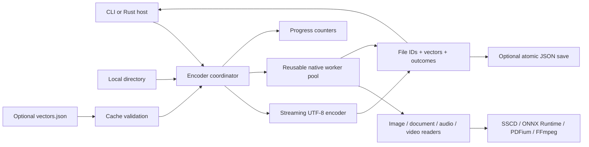

# FileTwin architecture — directory encoding and portable vectors

This document specifies the 0.2 interface. It replaces the previous catalog,
database, jobs, snapshots, matching and grouping design. The product encodes a
local directory and returns file IDs with vectors, optionally using a previous
vector file to avoid repeated encoding. Similarity decisions belong to its caller.

## Public contract

The CLI accepts `filetwin DIRECTORY [VECTORS_FILE]` and four operational options:
`--output`, `--model-dir`, `--backend`, and `--workers`. Its stdout is one
`VectorFile` JSON value; stderr is JSONL progress/errors. No thresholds, profile
opt-ins, stdin request language, configuration file, run ID, or query command is
needed. Help/version remain standard CLI output.

The Rust API exposes immutable `Encoder` configuration, `EncodeRequest`, a
shared `CancellationToken`, callback `Progress`, and returned `VectorFile`.
`read_vectors` and `write_vectors` implement the portable-file contract.
`encode` itself does not save a file. `EncodeRequest.output_file` reserves and
validates an output path so traversal excludes it; the host then calls
`write_vectors`. Native executable/library paths are host-supplied absolute paths.
The library changes no host signals or global runtime configuration and writes
to no host output stream. Hosts choose their own threading and progress UI.

Schemas are generated from Rust types and checked into `schemas/`:

| Schema | Value described |
| --- | --- |
| `vector-file.schema.json` | Complete returned result and optional reuse input |
| `progress.schema.json` | `data` in a stderr progress event |
| `error.schema.json` | Fatal/per-file error object |
| `profile.schema.json` | Immutable encoding profile definition |

The canonical examples and parameter descriptions are in [README.md](README.md).

## Components

`filetwin-core` owns traversal, original-byte hashing, cache validation, admission,
temporary resources, text features, worker coordination and result assembly.
`filetwin-cli` maps arguments/environment and signals to that API and serializes
the response. `filetwin-worker` isolates native libraries, model sessions and
decoder subprocesses. There is no database dependency or persistence service.

## Identity and encoding compatibility

`file_id = "sha256:" + lowercase_hex(SHA256(all_original_bytes))`.
Moving, renaming or copying identical content preserves the ID. Changing any
byte changes it, even with preserved length and modification time. Hardlinks and
copies share one content identity but retain separate relative-path records.
This identifier also applies to unsupported formats when their full bytes can
be read. A changed/unreadable source cannot claim a verified current ID.

`profile_id` is the digest of an immutable encoding manifest: preprocessing,
reader policy, algorithm/model, vector dimensions, and execution backend.
Existing algorithm IDs remain unchanged by the persistence rewrite. Historical
profile definitions remain registered for compatibility and inspection, while
new requests select the current text/document, image, audio and video profiles.
The names retain `experimental-*` until accuracy qualification is complete.

Reuse key: **(content ID, current profile ID)**. A cache does not grant permission
to open its stored paths. Directory relocation is safe because current paths are
discovered independently. Unknown profile IDs are rejected on load. Image and
video profiles remain distinct despite both having 512 components; text/document
and audio profiles remain distinct despite both having 4,096 components.

Caller similarity is cosine over compatible ready vectors. Callers choose matrix
layout, percentage display, thresholds and grouping semantics. FileTwin does not
build or persist pairwise scores. Equal file IDs give exact-copy evidence even
when a semantic vector is unavailable; raw-byte hashing is not semantic encoding.

## Encoding lifecycle

1. Validate configuration and directory. Resolve caller paths, reject symlink
   roots, and securely open originals with no-follow component traversal.
2. Parse and validate an optional previous vector file. Preflight a requested
   output path. Exclude these artifact paths and model/private staging directories.
3. Inventory the directory recursively, including hidden files. Track visited
   directory identities. Report unreadable children and skipped nonregular entries.
   Discovery starts with `files_total: null` and then publishes its known total.
4. For each regular file, sniff contents/extension, observe its revision, and
   stream all bytes through SHA-256. For native candidates, copy to private staging
   during that read when admitted. Source-byte counters exclude private reads.
5. Recheck the open original and its pathname. If an identical input is already
   in flight, wait for it before attempting reuse. Look up the current profile in
   the saved/in-call cache. Successful hits get the new path and `reused: true`.
6. Encode cache misses: UTF-8 features in the coordinator; native readers in a
   bounded worker pool. Media probing chooses video or audio from actual streams.
7. Validate native response family, profile, dimension, finite values and unit
   norm. Verify the original descriptor/path still describe the observed revision.
   Publish the vector only when these checks pass. Otherwise publish an error;
   invalidate the ID too if the source changed.
8. Stop/drop all workers, sort completed records by relative path, return the
   vector file and final counters, then release private temporary resources.
   The CLI optionally saves the result atomically before writing stdout.

All current originals are hashed even when a matching vector already exists.
There is no path/mtime shortcut. Native staging may occur before the cache hit
is known; the temporary copy is discarded when reuse succeeds. Persistent models
and worker processes are reused within one invocation, never retained by a
background service between invocations.

Stable descriptor/path metadata checks detect ordinary concurrent edits and
replacement. A directory traversal is not a filesystem snapshot: a file added
after its directory was listed can be absent. Concurrent hostile changes with
undetectable metadata effects are outside this local filesystem contract.

## Portable vector file

Root fields: `format: "filetwin-vectors"`, `schema_version: 1`, `directory`,
`complete`, `files`, and `summary`. Each file contains its relative path, optional
verified content ID, byte length, state, family/profile, vector and checksum,
reuse flag, optional error, and reader-specific extraction provenance.
Provenance and inference timings on reused vectors describe their original
encoding; summary counters/timing describe the current invocation.

Ready vectors are normalized float32 arrays. `vector_sha256` hashes their
little-endian float32 bytes. Failed, unsupported or skipped records have null
vectors/checksums and do not claim reuse. Source changes remove the content ID.
Error codes distinguish decoding, runtime availability/integrity, invalid text,
insufficient content, resource allowance and worker failures.

UTF-8 paths serialize as strings; arbitrary POSIX filename bytes serialize as
`{encoding:"posix_bytes",base64:"..."}`. Stored file paths must be unique,
nonempty, relative paths without parent components. Cache loading validates the
schema version, profile registry, dimensions, finite values, normalization,
checksums and duplicate/conflicting entries. Unknown struct fields and duplicate
JSON struct keys fail. Vector files are trusted local data, not signed model
attestations; an adversary could manufacture a self-consistent vector/checksum.

Both reuse inputs and saved outputs are bounded to 512 MiB. The result and reuse
map are held in memory; this interface is intended for directories that fit that
model, not an unbounded corpus. Stdout is a complete JSON value rather than a
stream of file records. Streaming/chunked vector formats would require a future
versioned contract if needed.

Saving validates the result and target, writes a private temporary file next to
the destination, flushes/syncs it and atomically renames it. Existing destinations
must be valid FileTwin vector files and are checked for changes before replacement.
New destinations use no-clobber creation; symlink/unrelated targets are refused.
Only the explicit output is replaced. Saving does not append to source metadata.
Do not have concurrent hosts write the same destination; unique outputs are the
simple caller policy. Old cache entries for deleted paths are absent from the new
result; no separate pruning or database cleanup operation exists.

## Progress, cancellation and failures

Progress includes stage, elapsed seconds, and counters for discovered/processed/
ready/failed/skipped files, encoded/reused vectors, original bytes read/hashed and
optional total files. Events occur at stage boundaries and periodically during
work. Host callbacks should be quick; a slow callback blocks the coordinator.
The CLI always writes JSONL progress to stderr, leaving stdout for the result.

Per-file decode errors continue processing other files. `complete` indicates a
finished traversal, not universal decoder success. An unreadable child directory
makes it false. `files_processed` counts returned path outcomes, including skips
and failed child-directory listings. Cancellation returns the completed records,
`complete: false`, and `summary.cancelled: true`; queued/pending files are omitted.
The result can be saved and reused. Processing has no resume token or checkpoint DB.

The CLI handles SIGINT/SIGTERM through the shared cancellation token. Rust hosts
call `cancel()` themselves. Worker/process groups are killed and staged files
removed on normal return, error or cancellation. Fatal input/output errors may
prevent a result. SIGKILL/power loss cannot return partial JSON or guarantee temp
directory cleanup; real workers monitor parent death and terminate descendants.
There is no crash-staging garbage collector.

Exit codes are 0 (all ready), 3 (partial/failed/skipped outcomes), 130 (cancelled),
2 (invalid request/cache), and 1 (fatal I/O/output error). Decoding failures such
as missing model assets are per-file outcomes, so a usable mixed result exits 3.

## Native execution and limits

Internal protocol version 3 uses bounded JSONL messages over nonblocking pipes.
Ship matching builds of both binaries. Each child has a private process group,
working directory and cleared environment; only approved runtime settings pass
through. Native libraries run outside the host address space. FFmpeg reads a
seekable descriptor with restricted protocols; no original pathname/network URL
is supplied to its demuxer. Full details are in [native-encoding.md](native-encoding.md).

Default admission: 2 workers (CLI CUDA defaults to 1), 2 inference threads,
2 GiB shared native memory allowance, 10 GiB active source-copy staging, 300-second
native file deadline, and 1 MiB worker response/diagnostic bounds. Worker count
is capped at 64 and one per 512 MiB of configured memory, with a minimum of one.
Per-file source staging reserves another 2 MiB for protocol buffers. Inputs too
large to stage are still hashed and may reuse an existing vector; otherwise
they get an explicit resource error. Reader allocations have further bounds.

These allowances do not cap whole-program RSS or all GPU memory. Linux CPU workers
use RLIMIT_AS. GPU driver address-space reservation prevents the same limit for
CUDA, whose provider has an arena allowance. CoreML compilation caches are private
to the invocation and removed on return. Pinned native assets are provisioned
explicitly; ordinary encoding has no network/model download step.

## Platform and deployment scope

Native targets: macOS 14+ ARM64; glibc Linux x86-64 and ARM64, with Ubuntu
24.04/26.04 CI coverage. CoreML is explicit on Apple Silicon. NVIDIA CUDA 12
is provisioned for Linux x86-64 with separately supplied driver and cuDNN 9.
CPU and CoreML have local integration evidence. Physical NVIDIA inference remains
to be qualified. Windows, Intel macOS, BSD and musl are outside qualified native
runtime coverage. Docker is optional; local CLI/library use needs none.

Deploy CLI, companion, native assets and applicable notices. Python is limited
to provisioning and development tooling. FileTwin's noncommercial license and
third-party asset terms remain in [LICENSE](LICENSE) and
[THIRD_PARTY_NOTICES.md](THIRD_PARTY_NOTICES.md).

## Migration and deferred work

This is a breaking 0.2 CLI/library change. Old 0.1 databases are left untouched and
not loaded. Run once with `--output` to create a new vector file. Old inode-based
IDs become content hashes; existing algorithms keep their profile IDs. There is
no implicit database migration or legacy command adapter.

Future work is limited by user need: broader decoder/codec qualification,
HDR tone mapping, OCR/other document readers, NVIDIA hardware validation,
large-corpus streaming, and signed distributable bundles. Remote sources,
watch daemons, database/index maintenance and automatic grouping are not part
of the present directory-to-vector API.
